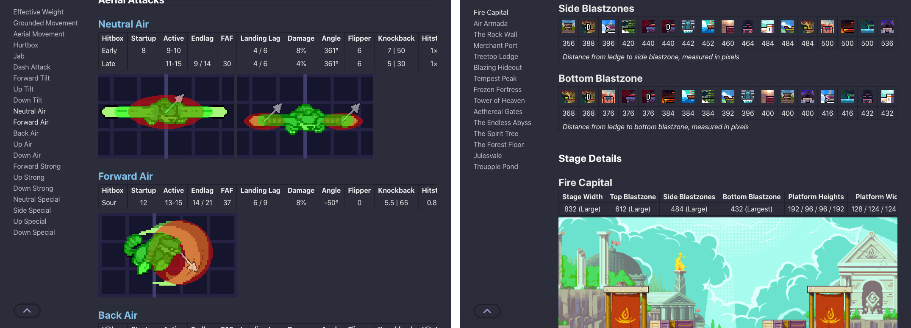

[](https://rivals.academy)

Official website and API of Rivals Academy. Built with [Hugo](https://gohugo.io/).

### Library

Visualizations + detailed stats for all characters, attacks, and stages in the game. Data exposed as open JSON API, generated alongside page HTML from edited YAML.

### Lectures

General + character strategy guide articles in English and Spanish. Writing of new guides facilitated through [Discord](https://rivals.academy/discord) with 20+ contributors so far.

## Development

[Install Hugo (Extended)](https://gohugo.io/installation/)  
Fetch source code and start live preview on `localhost`:

```bash
git clone https://github.com/blair-c/rivals.academy.git
cd rivals.academy
hugo server --minify
```

>Live preview often requires a `CTRL+Shift+R` / `CMD+Shift+R` browser refresh for CSS changes, and a full restart for content file deletions/renames.

>Many images including [Library](https://rivals.academy/library) hitbox images are scaled via GitHub Actions at build, and so changes to them won't display on site pages during development.

### Lectures Videos Compression

[Install FFmpeg](https://ffmpeg.org/download.html)  
Uncompressed videos in the base `/lectures` directories are removed during a GitHub Actions build step. The following script should be run when publishing a new strategy guide after moving it from `/lectures/drafts`:

```bash
sh compress_videos.sh [new-guide-directory]
```

> The path to the `ffmpeg` binary in this script may also need to be altered for the script to run properly.
