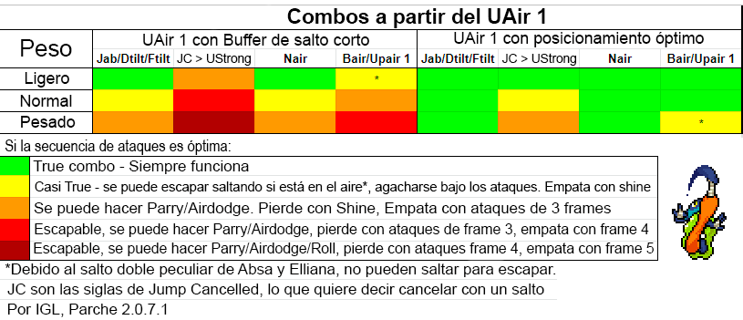

El primer golpe del UAir de Ranno es un movimiento bastante único, tiene la característica de que siempre aplica la misma cantidad de Knockback y Hitstun sin importar el porcentaje. Sabiendo esto, veamos algunas situaciones en donde podemos aprovechar esto para hacer combos. Algunos detalles que si van a afectar son:
- El peso del oponente
- Qué movimiento hacemos después
- Qué tan cerca estamos del suelo al usar el UAir

## Peso

Entre mas pesado sea el oponente, menos Hitstun va a recibir, lo que significa que los personajes pesados pueden actuar más rápido, esto se hace notar al intentar usar un Jab, DTilt o FTilt después.

Contra personajes mas ligeros como Maypul, estas 3 opciones no van a fallar.



Contra personajes mas pesados como Kragg, es posible hacerle Parry a estas 3 opciones.



## Combos

Los movimientos que eligamos usar van a depender de algunas cosas. Como vamos a aterrizar luego del UAir 1 si elegimos usar un ataque terrestre tendremos que esperar 4 frames de Lag de aterrizaje, por otra parte podemos [cancelar ese lag con un salto](/es/lecturas/entendiendo-el-lag-de-aterrizaje/#usando-el-jumpsquat), y usar un ataque aéreo o cancelar ese salto con un UStrong.

Las opciones terrestres más rápidas de Ranno, que se muestran en los clips anteriores, tardan 9 frames (4 frames de lag de aterrizaje y 5 frames de Startup) 

Usar el NAir también tarda 9 frames (5 frames de Jumpsquat y 4 frames de Startup), lo que lo hace una opción viable también.



Aún cancelando el salto inmediatamente, el UStrong va a tardar 11 frames en salir (11 frames de Startup), es lo suficientemente lento como para hacerle Parry.



Podemos implementar este movimiento en un combo si aplicamos otro factor:

## Posicionamiento

Entre más cerca esté Ranno del suelo al conectar el UAir, menos va a tardar en aterrizar para estar accionable de nuevo, lo que nos facilita seguir el combo. Hasta ahora todos los ejemplos han hecho un Buffer de Salto Corto antes del UAir, pero si nos posicionamos para usar el UAir junto al suelo cuando conecte, vamos a poder actuar 2 frames más rápido.

Con ese ligero cambio en los frames, ¡ahora podemos usar UStrong en el combo!



## Todo junto

Ahora que entendemos todos los factores que rodean este movimiento, podemos ver esta tabla que resume que tan viables son los combos con el UAir:

Nota: A pesar que algunos de estos combos dicen que son "true" (son verdaderos, no fallan), puede ser muy difícil ejecutarlos con la precisión necesaria para cumplir esa condición (pueden ser "frame perfect"). Pero esto no le resta valor al UAir 1, es un movimiento increíblemente rápido (especialmente si se toma en cuenta el Hitfall) y casi no le da tiempo al oponente para reaccionar y/o defenderse.

Nota: Ninguno de estos combos va a funcionar si el oponente hace "Crouch Cancel", sin importar el peso del oponente ni que movimiento uses despues del UAir. Si notas que el oponente hace Crouch Cancel al UAir 1 es mejor tomar acciones evasivas.

Aquí hay un ejemplo de la utilidad del UAir 1 aparte de ser usado solo para combos:


