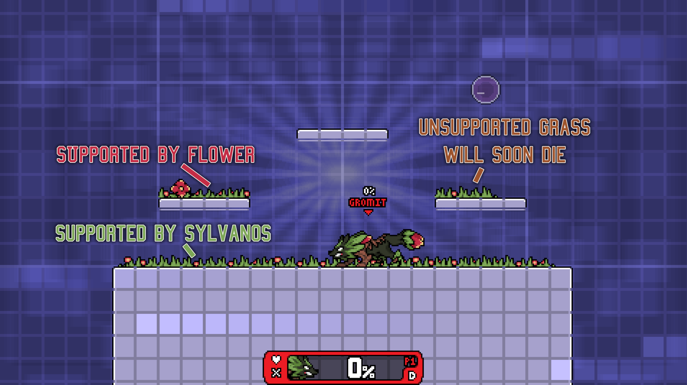
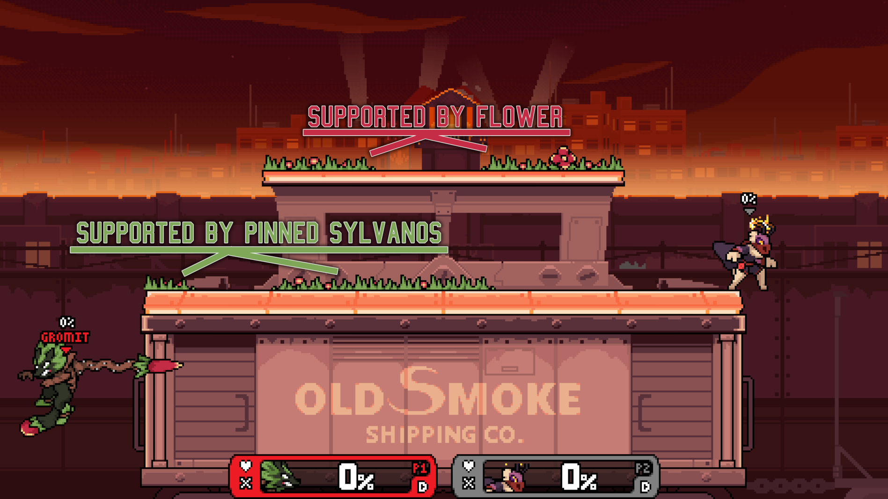
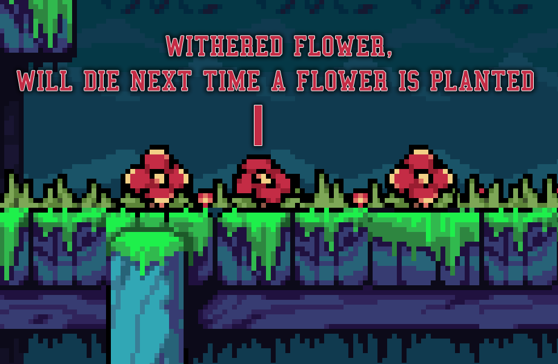
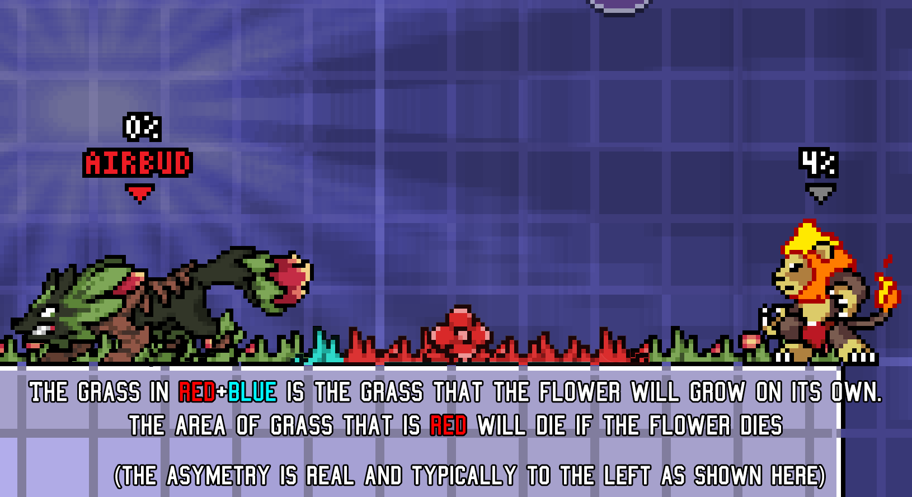

## Go Touch Grass

Sylvanos has the unique ability to passively generate grass as a stage resource for him to to take advantage of. By simply moving while grounded or wavedashing, Sylvanos will automatically grow grass underneath him. However, both rolling and tech rolling will not grow grass for you, making it hard to get grass down while under threat. Additionally, Sylv can plant flowers which will grow grass in a small area around them.

Like any good gardener knows, grass won't take care of itself, and Sylvanos’s grass is no different. Grass needs to be supported to stay alive and if your grass is left unsupported for a full second straight, it will die. Grass can be supported by one of two things: Sylvanos himself, or a flower. So long as Sylv or a flower is on the same surface, any and all grass on that surface will continue to be supported regardless of distance from its source of support. As long as support exists for a surface, grass will continue to survive even if it isn’t a continual line. Additionally, Sylvanos will count as being on the ground of a platform/stage to support grass if he is pinned to it with his Back Air (this includes being pinned to the wall of the stage). The one second grass death countdown is reset completely anytime the grass is even briefly supported.

### Usage

You’ve now grown a nice lawn, but what are you going to do with it? Grass has 3 uses, all involving your specials.

Firstly, grass buffs burrowing with Up Special in 2 ways: it causes Sylvanos to have 8  less frames of endlag unburrowing out of grass, and it allows you to hold your special button to input an attack while emerging from the grass, colloquially known as "Chomp." As a bonus, burrowing into the ground will grow grass right in the spot you burrowed, allowing you to chomp where you entered the ground even if there wasnt already grass there.



Next up is Side Special, also known as Beast Dash. This move will consume grass as it travels and have its duration/distance extended each time it eats grass. As a bonus if you travel over an area with no grass for it to eat, it will grow grass behind you, but it wont grow grass to replace any you eat. Additionally, it does not need a continuous path of grass to keep getting extensions. Just make sure there aren’t any gaps too big to stop it.



Finally we have Down Special, also known as Howl. This move sends out an invisible radial wave centered from the howl that causes any grass it passes over to erupt and hit opponents. This will kill the grass as no plant should endure such negativity. However, if Sylv is hit during howl, it will prematurely end the howl, causing no further grass to react to it. Additionally, grass will not die to time while howl is active and any grass killed by howl will go on “cooldown”, preventing the growth of grass in its place for a short duration.



These are the only effects grass has on the game — a very common misconception is that grass gives Sylvanos any kind of passive effect, typically claimed to be reduced landing lag on grass, but this is false.

## Plant Local Flowers

We talked a bit in the previous section about flowers as they play a huge part in managing your grass and have quite a few properties, so let's dissect how they work. 

You may only have up to three flowers planted at the same time. If you have three flowers alive at the same time you will notice that the oldest flower will wilt. This is to indicate which flower will die if another flower is planted. Flowers will also die if they are hit in any way by an opponent or if you hit them with your fspecial. Flowers as projectiles (often just called seeds) do not count towards the flower count, they must land first, so you can have three flowers + however many airborne seeds you can manage at once.

Flowers support all grass on the same surface as them as if they were Sylvanos. Having multiple flowers supporting the same grass gives no additional benefit outside of redundancy. However, if a flower dies due to being hit from an opponent, it will kill all the grass in a small radius around it, giving your opponent a way to clear grass.

Finally, since you are a good gardener who buys locally sourced healthy fertilizer, your flowers are quite resilient to projectiles. Flowers can absorb any non-piercing projectile such as Wrastor's Slipstream. Some projectiles that will even bounce off slightly, namely Kragg’s rock or Mollo’s bombs. Even Elliana's fully charged missile can be blocked by a lone flower, sacrificing their life to protect you such that you may plant an even prettier garden. Sprouting flowers are special however: for the first 60 frames starting from when a flower touches the ground, it will be immune to projectiles that deal under 8% while still blocking them as normal. Projectiles that deal more than 8% will still be blocked but will kill the flower.



### With Beast Dash

Arguably the biggest use for flowers comes from your Side Special, as it not only eats grass, but also flowers. Combine this with Side Special's ability to be canceled on hit into any action, known as a [Beast Dash Cancel](/lectures/beast-dash-cancelling-and-boosting).



## Competing Lawns

In the ditto,  there is no way for Sylvanos to support the grass of an opposing Sylvanos, nor can Sylv grow grass over an opponent's grass. Flowers also cannot grow grass over already existing grass. Grass must first be cleared before your own grass can be grown in its place.

Howl will not activate another Sylv’s grass, nor can Sylvanos use the chomp from unburrow on another Sylv’s grass. However, Side Special may eat grass and flowers as normal regardless of ownership. This allows Sylv to clear opposing grass even if that grass is supported.

Now that you have these seeds of knowledge planted, you can begin to play around grass and flowers to hedge your odds at winning, or grow your own strategies around them. Just remember to let your play blossom and dont get too distracted by the beautiful yardwork!
