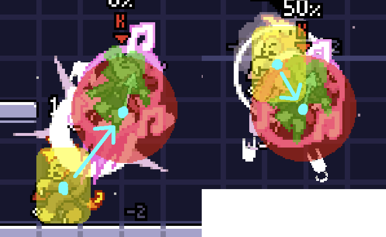


---
title: Pomme Tech
description: Técnicas básicas y no tan básicas de Pomme
authors:
- Kyb
tags:
- beginner
- intermediate
- advanced
- pomme
---

## Float
*Float* es la mecánica característica del movimiento de ~~Peach~~Pomme en todos los aspectos de su juego. Para empezar a flotar debes mantener el botón de salto presionado hasta que Pomme llegue al punto más alto de su salto, o mover la palanca hacia abajo mientras sostienes el botón de salto para empezar a flotar antes.



### Float en el suelo
Mantener presionado abajo antes de hacer el input de salto hace que Pomme flote justo sobre el suelo. Si sueltas el botón de salto durante este float en el suelo, Pomme aterrizará justo en el siguiente frame, lo cual puede ser usado para cancelar aéreos instantáneamente. Los ataques aéreos en el suelo son grandes herramientas para empezar combos y aplicar presión relativamente segura.



Nota: Si usas un control normal para jugar Rivals, la mayoría de los jugadores de Pomme recomiendan configurar uno de los gatillos o botones traseros para el input de salto. Esto te permite usar la c-stick para hacer los aéreos durante float sin tener que cambiar la forma en la que sostienes el control.

### Double Jump Protection
Rivals tiene una mecánica llamada Double Jump Protection (DJP) que restaura el segundo salto si haces un Up Special o air dodge en las primeras 4 frames después del salto. En particular, Pomme puede empezar un float durante esa misma ventana y también restaurar su salto. Esto puede ser usado para ganar un poco de distancia vertical extra gratis, o para usar el reset de momento horizontal inherente de hacer un salto a la dirección contraria a la que vas.



### Fastfall

[AAA]



### Float Storage
Pomme puede comenzar un float mientras tu "tiempo restante de float" sea mayor a 0 frames. Esto es importante debido a que las condiciones en las que este tiempo es modificado no son las más intuitivas:

* Iniciar o continuar un float: el tiempo restante se reduce por 1 por cada frame que estés flotando.
* Dejar de sostener el botón de salto para dejar de flotar: elimina todo el tiempo restante.
* Ser golpeado mientras estás flotando: elimina todo el tiempo restante.
* Hacer air dodge mientras estás flotando: elimina todo el tiempo restante.
* Hacer un UpSpecial hacia un Note Field (DownSpecial): el tiempo restante se vuelve un mínimo entre 45 frames y el actual tiempo restante de float [AAA].
* Aterrizar: restablece el tiempo restante a 2 segundos.

Es importante notar que el tiempo restante de float no se actualiza en las siguientes condiciones:
* Empezar la carga de notas de un NeutralSpecial durante un float.
* Empezar un UpSpecial durante un float.
* Empezar un DownSpecial durante un float.

Estas tres condiciones efectivamente *pausan* el float sin eliminar todo el tiempo restante como soltar el botón de salto lo haría. Esto te permite continuar flotando una vez acabada la animación de estos movimientos. Sin embargo, también puedes *almacenar* el tiempo restante de float si sueltas el botón de salto durante la animación, permitiéndote usarlo más tarde cuando más te convenga.



## Note Field
El Note Field (DownSpecial) de Pomme es su mejor herramienta para recuperarse y, por mucho, también es su movimiento menos entendido. 

### Omnifloat
Down Special poner un campo de notas que mejora las capacidades del float de Pomme, incrementando su aceleración significativamente y permitiéndole flotar en cualquier dirección en lugar de solo horizontalmente (llamémosle "omnifloat"). Esto te permite extender tus combos aéreos o hacer baits en neutral muy efectivos.



Adicional a los métodos comunes para empezar un float, también puedes empezar un omnifloat sosteniendo salto + arriba. Combinando esto con el [double jump protection](#dj-protection), puedes usar el pequeño boost de momento vertical del salto y justo después empezar a flotar hacia arriba para moverte más rápido en el Note Field y sin usar tu doble salto.



### Up Special en Note Field
Pomme puede hacer un UpSpecial dentro de un Note Field para hacer un UpSpecial mejorado que restaura su float ([float storage para más detalles](#float-storage)) y no termina en pratfall. Esto es activado con que la hurtbox de Pomme toque cualquier punto de un Note Field en cualquier momento de la animación del UpSpecial.
Cabe destacar que Pomme solo puede restaurar su float 1 vez por airtime, ya que hacer esto pone DownSpecial en cooldown y hace desaparecer el Note Field. Si Pomme intenta hacer un segundo UpSpecial justo después de esto, solo hará un pequeño impulso vertical sin hitbox que inmediatamente la pone el pratfall. 



### Curiosidades de Note Field
Si Note Field se encuentra muy lejos del fuera del escenario, este automáticamente se acercará al escenario. Horizontalmente, intentará acercarse al escenario hasta que una de sus esquinas toque o esté contenida en los bordes del escenario (no de plataformas que sobresalgan). Verticalmente es más un misterio, pero en general tratará de alejarse de los bordes de la pantalla.

Down B tiene unos bugs tremendos que no voy a explicar pero aquí hay un clip abusando de la manera en la que el cooldown se supone debería activarse.



## Boost de momento de Fair
El Forward Air de Pomme la empuja hacia atrás, dándole una opción de movimiento única que puede usar durante saltos o flotando. Esto es un boost en el momento de Pomme encima de su velocidad horizontal actual, de manera similar al Fair de Orcane. Usar Fair mientras te mueves hacia adelante te empujará muy poco hacia atrás, y usarlo mientras te mueves hacia atrás te empujará mucho más.



### Deslizarse con el momento de Fair
El boost de Fair tiene su punto más rápido justo cuando el ataque comienza (1 frame antes de que la hitbox salga), y la velocidad disminuye rápidamente después de eso. Combinando esto con la poca fricción de suelo que tiene Pomme, significa que aterrizar en las primeras frames de un Fair hace que Pomme se deslice sobre el suelo mucho más rápido que corriendo o con wavedashes.



Esta técnica también permite muy fácilmente hacer edgecancel, una gran opción de movimiento y presión.



## Cancelar carga de Notas
Pomme puede cancelar la carga de notas (NeutralSpecial) en cualquier momento presionando parry. Cancelar la carga siempre es más rápido que simplemente soltar NeutralSpecial para dejar de cargar notas, haciendo que esta técnica sea estrictamente mejor en todas las situaciones y una herramienta invaluable para Pomme.

Empezar a cargar notas durante un float hace que este se pause, haciendo que Pomme caiga durante la animación de carga. Una vez que termine la animación, float continuará con el mismo tiempo restante que tenía antes de empezar a cargar notas (asumiendo que sigue sosteniendo el botón de salto). Esto hace todavía más importante cancelar las cargas de notas para conservar la altura de un float. Esto usa el mismo principio de [almacenamiento de float](#float-storage) de arriba, pero inmediatamente continuando el float en lugar de guardarlo para más adelante.



También, por alguna razón, mantener presionado parry cancela todas las cargas de notas sin tener que presionar parry de nuevo.



### Voltearse con Specials
Usar Neutral Special haciendo B-reverse es una manera rápida de voltearse en el aire. Esto se puede usar en recuperaciones usando Fair para impulsarse de regreso al escenario después de voltearse con un NeutralSpecial reverseado.



Pomme también puede voltearse usando los cooldowns de sus 3 Specials. Hacer un NeutralSpecial, SideSpecial o DownSpecial reverseado mientras están en cooldown hace que Pomme se voltee sin ninguna animación, startup o lag.



## Vince
Los oponentes comúnmente pueden golpear de regreso el SideSpecial de Pomme (Vince maestrazo) para cancelar su command grab. Sin embargo, cargar por completo el SideSpecial hacer que Vince sea invulnerable a todos los ataques y permitiendo que el command grab siempre suceda incluso cuando golpean a Vince. Esto es muy útil durante edgeguards ya que golpear a Vince hará que el oponente pase por todo el hitpause de golpearlo, permitiendo fácilmente castigar su recuperación.



Pomme también puede cargar SideSpecial mientras flota, incluso en un omnifloat de un Note Field. Esta mecánica es muy útil en recuperaciones.



Vince está lleno de bugs así que hacer una lista de todas las interacciones rotas aquí sería un esfuerzo monumental. Les recomiendo hacer pruebas en sus juegos y tomar notas :)

## Más techs

### Cancelar Down Tilt con salto
Por alguna razón, Pomme puede cancelar DownTilt saltando lol



### DACUS
Todos los personajes de Rivals excepto Wrastor pueden hacer un Dash Attack Cancel Up Strong haciendo un UpStrong justo después de un DashAttack. El movimiento muy rápido del Dash Attack de Pomme combinado con su baja fricción de suelo hace que su DACUS sea bastante impresionante. 



### Ángulo del UpSpecial
Todos los golpes del UpSpecial de Pomme antes del último golpe tienen un angle flipper 2, que hace que su ángulo de knockback sea una línea que empieza del centro de la hurtbox del oponente apuntando hacia el centro del hitbox de UpSpecial. Esto puede causar edgeguards muy graciosos en los que golpear a un oponente UpSpecial por debajo de ellos y cancelar el último golpe con un wall jump saca al oponente por la blastzone de abajo.

