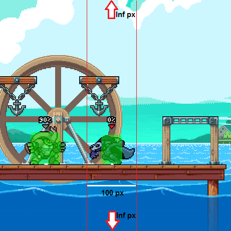
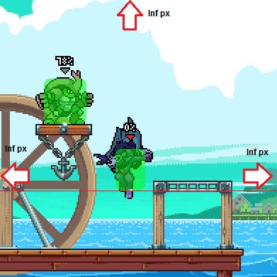
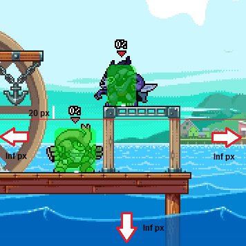
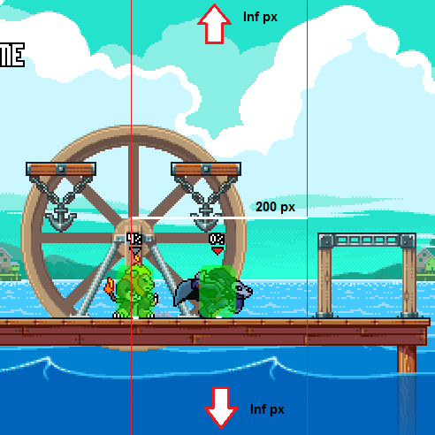
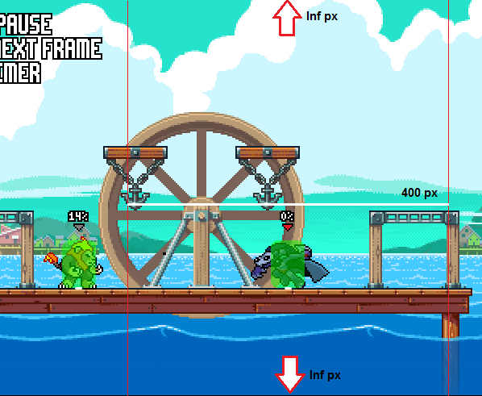
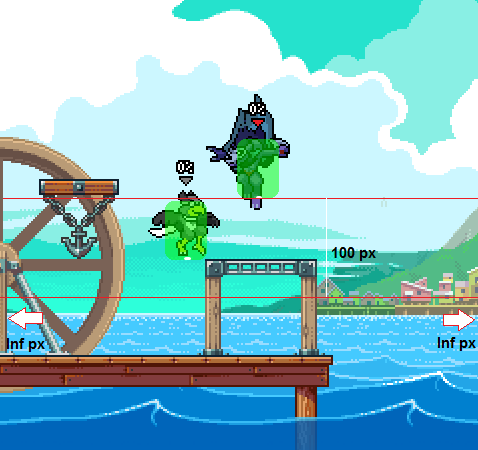

## Las bases

El clon de Forsburn tiene dos modos: Ataque y Escape. Cuando el clon aparece está en modo ataque, y se puede cambiar de un modo a otro si se toca el botón de ataque especial (NSpecial o FSpecial).

Además si se mantiene presionado el botón de ataque especial para evitar que el clon use su salto doble o el USpecial. Esto es útil para hacer Edgeguard o volverse más impredecible al regresar al escenario.

En esta guía se repasará a profundidad como el posicionamiento afecta el comportamiento del clon en ambos modos.

> Nota: El "Punto Origen" que se menciona a lo largo de la guía se refiere a un punto en el centro inferior de la Hurtbox de los personajes. Se han marcado estos "Puntos Origen" con un puntito blanco en las imágenes que se muestran (la marca blanca es más grande de lo que es el Punto Origen en realidad para que se pueda visualizar más fácilmente). Además, si hay una flecha significa que el área de influencia se extiende infinitamente en la dirección que señale.

## Modo ataque

### Hacia el oponente

Mientras el clon está en el suelo, si el origen del oponente está a un rango mayor a 50 pixeles horizontalmente del origen del clon, existe una probabilidad del 50% (cada frame) de que el clon corra hacia el oponente. 

### Salto doble

Mientras el clon cae, si el origen del oponente esta sobre el del clon, existe una probabilidad del 10% (cada frame) de que el clon use el salto doble.

### Salto alto

Si el clon está en el suelo, y el origen del oponente está a mas de 100 pixeles por encima del origen del clon, existe una probabilidad del 8% (cada frame) de que el clon haga un salto alto.

### A través de la plataforma

Si es clon está sobre una plataforma, y el origen del oponente está a más de 20 pixeles por debajo del origen del clon, existe una probabilidad de 6% (cada frame) de que caiga a través de la plataforma.

## Modo escape

### Huir del oponente

Si es clon está en el suelo, y el origen del oponente está en un rango horizontal menor a 100 pixeles del origen del clon, existe una probabilidad de 90% (cada frame) de que el clon correrá alejandose del oponente.

### Hacia el oponente

Si el clon está en el suelo, y el origen del oponente está en un rango horizontal mayor a 400 pixeles del origen del clon, existe una probabilidad de 45% (cada frame) de que corra hacia el oponente.

### Salto alto

Si el clon está en el suelo, y el origen del oponente está en un rango horizontal menor a 100 pixeles y no está a 100 pixeles por encima del origen del clon, existe una probabilidad del 8% (cada frame) de que el clon haga un salto alto.

### Salto doble

Si el clon está cayendo, y el origen del oponente está a menos de 100 pixeles por debajo del origen del clon, existe una probabilidad del 10% (cada frame) de que el clon haga un salto doble.

### A través de la plataforma

Si el clon está sobre una plataforma, y el origen del oponente está debajo del origen del clon, existe una posibilidad del 6% (cada frame) de que caiga a través de la plataforma.

### Correr en el borde

Mientras el clon es capaz de correr fuera del borde del escenario, existe una probabilidad de 70% (cada frame) de que el clon salte al llegar al borde.

Ojalá esta guía te ayude a comprender mejor el comportamiento del clon, que puede llegar a afectarlo y como es que el clon toma sus decisiones. Entender esto puede ayudarte a maniobrar alrededor del clon y jugar mejor contra Forsburn.