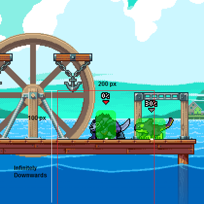
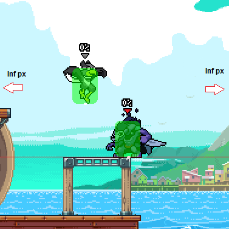
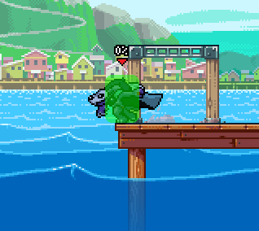

## The Basics

Clone has two modes: attack and evade. Clone initially spawns in attack mode, and can be toggled between the two behaviors by pressing Neutral Special or Side Special while clone is out.

Additionally, special can be held to prevent clone from double jumping or using Up Special. This is useful both for edgeguarding or increasing ambiguity while recovering.

In this guide, we'll be diving in-depth into how positioning affects clone behavior in the two different modes.

Note: Mentioned "origin points" are situated at the bottom center point of a character's hurtbox. I marked these points with a white dot, just enlarged for easier reference. Additionally, if there's an arrow pointing a certain direction, it just means the area of influence extends infinitely in that direction.

## Attack Mode

### Dash Towards

While clone is grounded, and the opponent's origin is outside of a 50px horizontal range around its own, there is a 50% chance each frame that it will dash towards the opponent.

### Double Jump

While clone is falling, and the opponent's origin is above its own, there is a 10% chance each frame that it will double jump.

### Fullhop

While clone is grounded, and the opponent's origin is over 100px above its own, there is an 8% chance each frame that it will fullhop.

### Platform Drop

While clone is on a platform, and the opponent's origin is over 20px below its own, there is a 6% chance each frame that it will drop through the platform.

## Evade Mode

### Dash Away

While clone is grounded, and the opponent's origin is horizontally within 100px of its own, there is a 90% chance each frame that it will dash away from the opponent.

### Dash Towards

While clone is grounded, and the opponent's origin is outside of a 400px horizontal range around its own, there is a 45% chance each frame that it will dash towards the opponent.

### Fullhop

While clone is grounded, and the opponent's origin is horizontally within 100px of plus not over 100px above its own, there is an 8% chance each frame that it will fullhop.

### Double Jump

While clone is falling, and the opponent's origin is within a 100px range below its own, there is a 10% chance each frame that it will double jump.

### Platform Drop

While clone is on a platform, and the opponent's origin is below its own, there is a 6% chance each frame that it will drop through the platform.

### Runoff Prevention

While clone is about to run offstage, there is a 70% chance each frame that it will jump.

