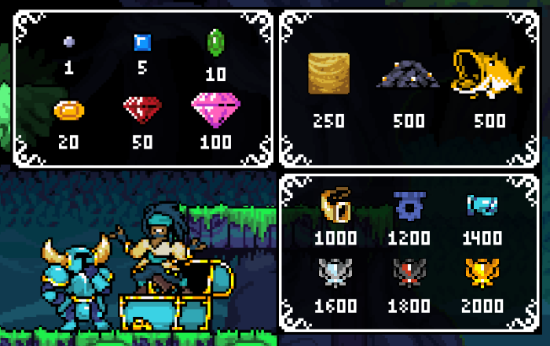

La habilidad pasiva de Shovel Knight le permite crear gemas coleccionables cada vez que golpea un oponente. El valor de las gemas siempre será **17 veces** la cantidad de daño que hizo el movimiento ($ = % x 17), el tipo de gemas que aparecen (visualmente) son aleatorias pero siempre van a sumar el resultado del cálculo explicado anteriormente. Las gemas se pueden recolectar durante 240-260 frames cada una, las gemas grandes tardan un poco más en desaparecer que las pequeñas.

## La tienda de Chester

Una vez que tienes suficientes gemas podrás gastarlas al usar la burla de Shovel Knight, la que hace aparecer a Chester y te deja ver el catálogo de reliquias y armaduras disponibles. Las reliquias reemplazarán tu NSpecial con un nuevo ataque y las armaduras te darán nuevas habilidades o cualidades.

Algo destacable de la tienda es que puedes comprar los ítems con el Stick derecho.

- **Izquierda** comprará el **Cuerno de Guerra**
- **Arriba** comprará el **Engranaje móvil**
- **Abajo** comprará la **Malla Dínamo**
- **Derecha** comprará la **Malla de Momentum**

Si quisieras comprar los **Guantes Fantasma**, solo presiona el botón de ataque normal al entrar en la tienda, ya que el cursor siempre comienza sobre ellos.

### Costo y valor

Debido a que este sistema de divisas es una de las partes más importantes del gameplay de Shovel Knight, ya que las reliquias y las armaduras pueden hacer una gran diferencia en la partida, es muy importante entender el valor de cada gema y cada objeto. La siguiente imagen muestra el valor de cada gema y objeto, así como también el valor de la roca del UStrong, la roca del DSpecial y el Pez Dorado.

Aún queda otro objeto que da gemas…

Al morir, Shovel Knight perderá 25% (una cuarta parte) de sus ahorros totales, esa cantidad se dividirá en 3 bolsas de diferente valor cada una. La bolsa grande tendrá la mitad de esta cantidad, la bolsa mediana tendrá una tercera parte de esa cantidad y la bolsa pequeña una sexta parte de esa cantidad. Las bolsas pueden ser recolectadas durante 600 frames (10 segundos), pero después de los primeros 300 frames (5 segundos) el oponente será capaz de recolectarla, así que asegurate de recuperar tu dinero perdido antes de que te lo quiten. Como son varias bolsas de diferente tamaño trata de darle prioridad a las más grandes primero ¡y ahorra para tu próxima gran compra!

¡Eso es todo por hoy!