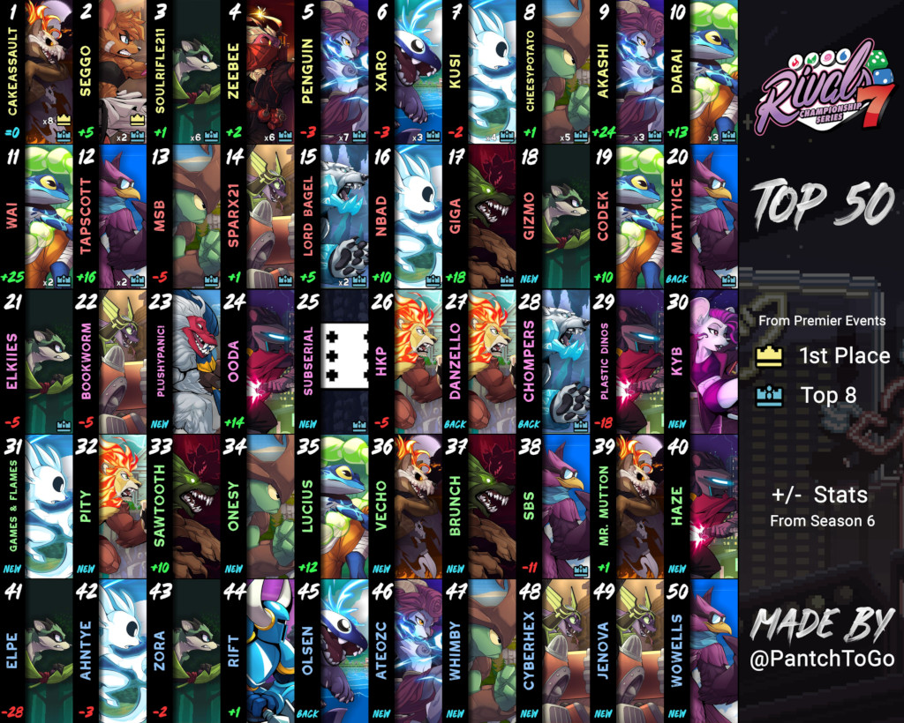


-*Video en inglés que explica un poco cada personaje, al igual que esta guía*-

En esta guía vamos a responder la pregunta clásica de cualquier jugador nuevo en un juego de peleas: "¿Que personaje elijo?"

Para poder responerla, vamos a dar una breve revisión de lo que ofrece cada personaje, repasando sus estrategias, fortalezas, debilidades, habilidades únicas y otros factores clave.

No se van a abordar resultados competitivos, ni posiciones en tier-lists por los siguientes motivos:
- Primero que nada, como jugadores nuevos es recomendable jugar con el personaje que se diviertan más y que encaje con su estilo de juego para que eso los motive a seguir jugando y aprendiendo el juego, elegir un personaje por que alguien en internet dijo que era el mejor no es la forma más sana de aprender un juego de pelea y puede arruinar las expectativas del juego.
- Segundo, en RoA cualquier personaje es lo suficientemente bueno para ser viable competitivamente y es un juego muy bien balanceado, por lo que depende de cada quien esforzarse para ser exitoso. Por ejemplo, démosle un vistazo al top 50 de la séptima temporada competitiva en norteamérica, aquí hay por lo menos uno de cada personaje en el juego:

- 

En otras palabras, no te vas a ver limitado por qué personaje elijas, escoge a quien quieras y te guste más. Ya sin más que decir, ¡comencemos!

## Zetterburn

Como el principe del Imperio de Fuego, Zetterburn sirve a su nación como un feroz guerrero, con orgullo y lealtad.

En general, Zetterburn es la manifestación del arquetipo "Spacie" en este juego. Para quienes juegan Fox, Falco o similares en Melee o Project M, van a encontrar muchas similitudes en el arsenal de Zetterburn.



El cambio más obvio que introduce Zetterburn a la fórmula clásica de los Spacies es su mecánica de fuego. Varios de sus movimientos van a incendiar al oponente, mientras el oponente esté en llamas recibirá daño poco a poco.



Todos los ataques fuertes de Zetterburn lanzarán al oponente más lejos si está en llamas, por lo que estos movimientos que son ya bastante fuertes se vuelven un poco más amenazantes. Adicionalmente tiene las herramientas necesarias para hacer combos con estos ataques fuertes, lo que significa que es fácil acceder a todo ese poder en un breve instante.



Zetterburn es conocido por ser volátil y abrumador cuando tiene la ventaja. También es considerado como un personaje bastante directo a la hora de jugar, ya que sus movimientos y estilo es relativamente ortodoxo y no tiene trucos muy locos en particular, convirtiéndolo en una elección popular entre principiantes.



Su desventaja más obvia es su Recovery, su plan para regresar al escenario es en esencia muy simple, y aunque tenga formas de variarlo sigue siendo algo con lo que tiene que lidiar, especialmente mientras se aprende a jugar. Es común para Zetterburn quedarse atrapado en un ciclo intentando regresar al escenario una y otra vez, especialmente contra ciertos personajes.



Aparte de eso, es considerado bastante completo, y un buen Zetterburn definitivamente puede brillar en cualquier situación que se le presente.

Puede que te guste Zetterburn si:
Puede que no te guste Zetterburn si:

## Orcane

Orcane es un chiquitín lleno de trucos conocido por sus travesuras. A pesar de tener mala fama con los Mercaderes de Agua, usualmente lo contactan para hacer el trabajo sucio a escondidas.

Sus movimientos reflejan su naturaleza traviesa, ya que se beneficia de condicionar al oponente, poniendo trampas y siendo oportuno. Sus ataques normales tienen buen Frame-data y Hitbox decentes, lo que le permiten atacar con confianza cuando la oportunidad se presenta. Para complementar también tiene a su disposición bastante poder ofensivo.



Orcane es capaz de flanquear a sus enemigos con ayuda de sus charcos, todos sus ataques especiales y ataques fuertes interactúan de una u otra forma con ellos, desde usarlo como obstaculo al hacer un pilar de burbujas hasta extender y fortalecer sus ataques. Su mayor uso es para teletransportarse hasta él con su USpecial.



Acercarse con sus movimientos de poco compromiso en neutral junto a usar sus charcos como trampas resulta en una combinación letal, una vez que se ha condicionado al oponente para que tenga miedo del charco es cuando Orcane brilla más.



Dicho esto, a pesar de ser bueno colocando trampas y haciendo mixups, Orcane no tiene opciones o proyectiles de larga distancia consistentes ni una opción rápida y volátil, por lo que a veces se le puede complicar acercarse a algunos oponentes. Orcane depende de donde esta colocado el charco para tener opciones de larga distancia, por lo que primero debe colocarlo y además debe evaluar si vale la pena utilizarlo o aprovecharlo en otra situación.



Al final del día, Orcane es una escurridiza sabandija que no tiene problema en mantener dudando al oponente con jugadas inteligentes.

Puede que te guste Orcane si:
Puede que no te guste Orcane si:

## Wrastor

Como un hábil guererro de la Armada Aérea, Wrastor vuela bajo la bandera de la Nación de Aire, ganando su reputación por su destreza en la lucha y su naturaleza audaz y despreocupada en igual medida.

Wrastor es un peleador aéreo con alta movilidad y una capacidad inigualable para perseguir a los oponentes por los cielos. Tiene más saltos dobles que cualquier otro personaje, 4 en total. Con todos esos saltos, su control aéreo y sus ataques aéreos puede malabarear y arrastrar a los rivales desde el suelo hasta la Blastzone con buen posicionamiento y reaccionando al DI.



Para complementar todo esto, los ataques fuertes de Wrastor son únicos, ya que solo se pueden usar en el aire, aún así funcionan increiblemente bien con su estilo de combos.



Podemos hallar otra propiedad especial en los Tilts de Wrastor, estos pueden cancelarse con un salto, lo que le ayuda a iniciar todos sus magníficos combos.



El FSpecial de Wrastor coloca en el escenario la famosa "Slipstream", es una corriente de aire que incrementa su velocidad horizontal mientras viaja a través de ella.



Esta alta velocidad le permite sobresalir en un estilo de juego agresivo donde abruma la competencia o en un estilo de juego defensivo basado en aprovechar la movilidad para esquivar y castigar al oponente.



Haciendole juego a su fama de velocista, Wrastor es el personaje más ligero del juego, en todo el sentido de la palabra, convirtiéndolo en un "cañón de cristal", lo que quiere decir potente pero frágil.



Sin importar que estilo prefieras, Wrastor sobresale castigando oponentes que se acercan sin pensarlo mucho, controlando el ritmo de la partida y amenazando arrebatar las Stocks en un abrir y cerrar de ojos. Cualquiera que se enfrente a Wrastor debe ser cuidadoso con lo que hace o enfrentar las consecuencias.

Puede que te guste Wrastor si:
Puede que no te guste Wrastor si:

## Kragg

Kragg es un firme miembro de los Corredores del Muro, un grupo dedicado a mantener La Muralla de Roca, que protege el Bosque Etéreo del mundo exterior mientras a la vez contiene su ira interior.

Kragg es lo más cercano a un personaje de peso pesado tradicional que RoA puede ofrecer. Su alto peso y rápida velocidad de caída le permite sobrevivir hasta altos porcentajes sin problema. Por otra parte su movilidad es relativamente poca si se compara con los demás, aunque no demasiado, por lo que es capaz de seguir el ritmo a los otros.



Como el matón que es, Kragg golpea bastante fuerte, un mínimo error del oponente puede darle la vuelta a la batalla.



A pesar de ser más grandulón, su Frame-Data es bastante buena, y definitivamente puede defenderse en la mayoría de situaciones de corta distancia.



Para complementar sus robustos ataques normales, sus ataques especiales le permiten jugar defensivamente muy bien. Su roca es un increíble proyectil con mucha utilidad, puede lanzarse en varios ángulos o romperse en una lluvia de fragmentos.



Si combinamos esto con el resto de su arsenal, como su DSpecial, es posible presionar bastante al oponente desde una distancia considerable, puede encontrar uno que otro problema para defenderse en un rango intermedio, pero una buena preparación puede evitar esto.



El USpecial de Kragg invoca un pilar de piedra por debajo suyo. Esta herramienta le brinda una flexbilidad increible a sus opciones para regresar al escenario, aunque si se usa sin cuidado puede dejarlo vulnerable.



Su kit es relativamente fácil de comprender, y a la vez tiene bastante profundidad para aprender; pero Kragg se mantiene lo suficientemente accesible para ser una opción común entre principiantes.

Puede que te guste Kragg si:
Puede que no te guste Kragg si:

## Forsburn

El hermano de Zetterburn, acusado erroneamente por el asesinato de su padre. Forsburn se ha retirado a las sombras en el exhilio y ha formado equipo con los rebeldes de la Tribu de Humo para tratar de exponer la corrupción del Consejo de Fuego.

El kit de Forsburn es una combinación entre control del escenario y spacing de alcance intermedio con un estilo de juego engañoso. Forsburn ataca con una capa y una daga, dandole buen alcance en varios de sus ataques sin tanto riesgo de ser castigado.



Su movilidad en general está un poco por debajo del promedio, y no tiene ningún proyectil para lanzar en neutral, por lo que es particularmente importante tener buen posicionamiento y poder jugar pacientemente cuando la situación lo amerite para jugar óptimamente.



Su capa y varios de sus ataques normales, especialmente los que lanzan al oponente verticalmente, tienen buena sinergía con su rango de acción para detener a los oponentes una vez que encuentra una apertura, forzandolos a caer en potenciales trampas.



Los movimientos especiales de Forsburn impulsan su habilidad de mantener a los rivales dudando. Puede colocar una pantalla de humo para ocultar sus movimientos y negarle esa información a su oponente, el cual se verá forzado a adivinar en donde se encuentra Forsburn.



Los oponentes pueden eliminar el humo al hacer cualquier ataque, pero deben tener cuidado de no atacar en el lugar y momento equivocados, porque Forsburn acecha en las sombras y puede atacarlos de vuelta.



Forsburn puede crear un clón para engañar al oponente, y también puede explotar el clón para crear una apertura si es que el rival ha adivinado mal quien era el verdadero Forsburn.



Si combinamos todo lo mencionado anteriormente, podemos ver uno, si no es que el mayor, juego mental en todo RoA.



La presencia de Forsburn engendra ofuscación e incertidumbre, y un Forsburn que puede jugar de forma impredecible es un enemigo realmente amenazador.

Puede que te guste Forsburn si:
Puede que no te guste Forsburn si:

## Maypul

Como habitante de las copas de los árboles, Maypul vigila el Bosque Etéreo, actuando como enlace con los habitantes de la superficie y como protectora de los bosques de las profundidades.

Maypul es una velocista que premia la precisión y el control. Tiene la mayor velocidad terrestre en el juego por un gran margen.



Toda esa movilidad se convierte en el potencial para tener mejor posicionamiento que sus oponentes, pudiendo cerrar brechas con los rivales en un abrir y cerrar de ojos. Tiende a jugar bastante por el suelo, ya que su presencia aérea es un poco más lenta y su Neutral funciona mejor cuando aprovecha su movilidad terrestre para reposicionarse.

Sus ataques normales son bastante buenos en general, formando un kit bastante sólido, a veces tiene problemas venciendo directamente otros movimientos, pero su velocidad es capaz de compensar esa pequeña debilidad.



Su DSpecial planta a Lily, quien lastimará a todo aquel que se acerque lo suficiente. Es importante mantener la presencia de Lily en el escenario, ya que puede aprovecharla como herramienta para extender combos o simplemente mantener control del escenario.



Otros ataques especiales se encargan de marcar al oponente. Un oponente marcado será atado si Maypul usa sus ataques fuertes o si es atrapado por Lily, lo que le brinda a Maypul mayor creatividad para seguir o terminar sus combos.



Adicionalmente, Maypul puede viajar hasta un oponente marcado con su USpecial, ya sea para regresar al escenario o extender algún combo. Esta herramienta es lo que vuelve los castigos de Maypul tan letales, ya que le permiten perseguir al oponente sin importar la distancia.



De forma similar a un vehículo de Fórmula 1, Maypul necesita alta precisión de aquellos que la piloten. Con un conductor hábil será difícil que la dejen atras.

Puede que te guste Maypul si:
Puede que no te guste Maypul si:

## Absa

Absa es una renombrada cientifica que ejerce el poder de las tormentas para defender la segregada sociedad de la Cumbre Tormentosa de la guerra que asola la superficie.

Absa es un personaje con mucho poder explosivo y alta capacidad de mantener el oponente a distancia. Su kit se hace respetar a cualquier rango y se beneficia de condicionar al oponente.



Absa también es un cañón de cristal, con algunos de los movimientos y combos más letales en el juego, a la vez que es de los personajes más ligeros y vulnerables una vez que se han vencido sus defensas. 



Su movilidad terrestre es bastante promedio, y su kit no es el mejor para correr directo al oponente. Pero su alta velocidad aérea, baja velocidad de caída y sus increíbles opciones para volver al escenario le permiten moverse por el aire libremente así como perseguir a sus oponentes.



Su habilidad característica es invocar nubes. Puede aparecerlas bajo sus pies o lanzarlas volando directo a sus oponentes.



Estas nubes son la piedra angular de su estrategia, puede interactuar con ellas de distintas formas. Desde explotarla desde la distancia para interrumpir al oponente o extender los combos, hasta detonarla con los ataques aéreos para aumentar el tamaño de sus poderos Sweetspots. Absa también puede generar un poderoso rayo entre ella y la nube.



Las nubes complementan su movilidad y su FTilt para formar una de las defensas más potentes del juego. La presencia de una nube por si sola representa algo que se debe respetar.



Pocos personajes tienen la capacidad de destruir la fortaleza mental del oponente como Absa, su estilo único de combinar defensa y poder letal la hace un personaje perfecto para aquel que busque jugar un personaje dominante.

Puede que te guste Absa si:
You might not like Absa if:

## Etalus

Etalus es un guerrero proveniente del norte de Aether. Como uno de los últimos sobrevivientes de la Guardia Porteña de élite, su meta es destruir el misterioso Hielo Negro.

Etalus es un grandulón que golpea como un camión. De muchas formas está construido como un personaje pesado tradicional, pero su mecánica de hielo le funciona como base para varias de sus fortalezas y le da un giro nuevo a conceptos viejos.



Etalus puede colocar hielo sobre el suelo con varios de sus movimientos. El hielo disminuye su fricción en el suelo, permitiéndole deslizarse y mejorar su wavedash y su Dash-Attack, los cuales puede combinar para ir y venir a lo largo del escenario a velocidades sin igual, lo que lo hace difícil de atrapar.



Etalus también puede recubrirse de hielo para utilizarlo como armadura, volviendolo extremadamente pesado y difícil de eliminar, su armadura resiste una cantidad de porcentaje antes de romperse, también puede perderla con ciertos ataques.



Aún sin armadura Etalus sigue siendo rápido y resistente, aunque es un objetivo bastante grande y puede hacerlo fácil de combear, particularmente fuera del escenario ya que sus métodos para regresar al escenario suelen ser algo vulnerables, o si lo atrapan con la armadura en una situación incomoda.



La alta velocidad y movilidad de Etalus lo hacen muy bueno castigando al oponente. Además tiene la habilidad de congelar al oponente para infligir aún mas daño en algunas situaciones.

Etalus es relativamente bueno evitando que el oponente regrese al escenario gracias a su FSpecial y el tamaño de sus ataques.



Tener buen control del hielo a lo largo del escenario es muy importante, ya que este lo ayuda en muchas situaciones. Sin embargo esto no significa que Etalus depende del hielo para ser bueno, su kit es fundamentalmente fuerte y robusto.



Etalus puede llegar a ser bastante flexible a la hora de jugar, controlando el escenario usando su movilidad y el resto de sus herramientas para infundir miedo en el oponente.

Puede que te guste Etalus si:
Puede que no te guste Etalus si:

## Ranno

Ranno es un hábil maestro de las artes marciales que proteje su tierra natal, el Estuario Pantanoso, bajo una doctrina pacifista; aún así sus habilidades de combate son letales.

Ranno es bastante directo, consistente y adaptable, lo que lo hace bastante sencillo para los principiantes. También tiene una Frame-Data bastante favorable, y puede darse a conocer con un estilo bastante opresivo y lleno de movimientos en cadena, capitalizando en cualquier apertura que encuentre. Es famoso por se increiblemente bueno castigando un oponente descuidado.



Sus dardos son excelentes proyectiles para condicionar al oponente y para interrumpirlos dentro o fuera del escenario.



Estos dardos, junto a los ataques fuertes, aplican veneno al oponente, lo que hace que reciban daño cada vez que atacan.



El veneno también mejora el FSpecial, este movimiento atrapa al oponente en una burbuja y el veneno hace que se queden dentro más tiempo, aumentando el potencial de los combos.



Estas herramientas hacen a Ranno muy bueno condicionando al oponente, forzando a los oponentes a respetar sus ataques veloces y susceptibles a ser castigados si dudan demasiado.

Su movilidad terrestre es muy buena, y puede aprovechar muy bien las plataformas, sin embargo, su velocidad aérea es muy baja, por lo que a veces tiene problemas para acercarse o perseguir al oponente por el aire. Muchos de sus combos tienden a usar Hitfall para poder reposicionarse en el suelo y evitar este problema.



Esa baja velocidad aérea le da otro problema, se le dificulta aterrizar contra oponentes experimentados, especialmente con lo limitadas que pueden ser algunas de sus Hitbox, aún así sus aéreos son buenas opciones para quitarse de encima al oponente, por lo que no queda tan vulnerable siempre.



Ranno es un personaje ágil y accesible, lo bastante versátil como para desempeñar cualquier papel y lo bastante completo como para imponer su presencia mientras lo hace.

Puede que te guste Ranno si:
Puede que no te guste Ranno si:

## Clairen

Clairen es una intrépida viajera en el tiempo de un futuro condenado. Bendecida con el don perdido del fuego, fue enviada al pasado para corregir los errores del futuro Imperio del Fuego y salvar a su mundo de un régimen corrupto.

Es la versión de Rivals de un personaje con espada. Su espada de plasma le proporciona un alcance impresionante. Puede utilizar golpes largos contra su oponente desde una distancia con la que la mayoría de personajes no podrán competir.



Sin embargo, Clairen no es una simple espadachin, ella tiene un estilo de juego llamativo y complejo gracias a la mecánica de su espada. Cualquier golpe con la punta de la espada aturdirá temporalmente al enemigo, lo que le permite mejorar sus combos.



A pesar de tener bastantes herramientas para elaborar una ofensiva impresionante, no se debe lanzar golpes sin sentido alguno, muchos de sus movimientos tienen mucho Lag final, lo que la deja vulnerable a ser castigada.



Por ese lado, Clairen puede ser muy buena también con un estilo de juego defensivo, aprovechando su rango de ataque para presionar al oponente.



A pesar de que su USpecial es muy grande y algo difícil de enfrentar al principio, no tiene muchas opciones para regresar al escenario fácilmente, por lo que en ciertas situaciones puede quedar atrapada fuera del escenario una y otra vez.



Por otra parte, Clairen es muy buena evitando que el oponente regrese al escenario, tener a mano ataques con grandes Hitbox resulta ser bastante útil.



Clairen tiene acceso a una amplia variedad de Setups para eliminar al oponente, pero pueden llegar a ser bastante precisos. Un buen jugador debe ser consciente de las situaciones que puede crear y como reaccionar a ellas.



En resumen, ser consciente de los alrededores es indispensable para que Clairen tenga éxito, su kit es muy flexible y tiene una potencial solución a *casi* todas las situaciones y *solo si* estás lo suficientemente atento.

Puede que te guste Clairen si:
Puede que no te guste Clairen si:

## Sylvanos

Contenido por la Muralla de Roca, Sylvanos es la ira del Bosque Etéreo personificado, su meta es extender indefinidamente el bosque tras haber sido quemado y saqueado por muchos años.

Sylvanos es un personaje pesado enfocado en el control del escenario. Esta bien equipado para mantener lejos al oponente y dominar el terreno, usa varias herramientas de alcance intermedio para forzar al oponente a jugar de cierta forma. Es el personaje con más rango de ataque en el juego, con una variedad de Hitbox a su disposición.



Sylvanos tiende a jugar un neutral muy opresivo, manteniendo el oponente a una distancia en la que puede controlar el ritmo de la partida y evitar que el oponente se acerque demasiado.



Esto es casi una necesidad, ya que se le puede dificultar quitarse de encima a los oponentes cuando penetran sus defensas debido a que su Frame-Data es algo lenta y no tiene buenas opciones de escape.



Sylvanos combina su largo alcance con su alta movilidad terrestre y su habilidad pasiva (césped) para mantener una fuerte presencia en el escenario. Sylvanos deja un rastro de césped por donde pasa, y puede aprovecharlo con varios ataques especiales, puede lanzar espinas desde el césped con su DSpecial, extender su FSpecial y le añade una Hitbox a su USpecial.



Si Sylvanos deja el suelo por un pequeño periodo, el césped se marchitará, a no ser que haya una flor plantada, por lo que es escencial estar atento a las flores y donde sembrarlas.



A Sylvanos se le puede complicar eliminar al oponente, es común tener que usar opciones específicas o leer al oponente para lograrlo. Sylvanos compensa esto con su capacidad de subirle el porcentaje al oponente muy rápido mediante combos y Tech-chase. Es como meter el oponente en una licuadora y acumular el daño.



Sylvanos es de muchas formas un personaje polarizado, pero un jugador que sabe como aprovechar sus fortalezas puede volverse una amenaza que controla cada partida como ningún otro.

Puede que te guste Sylvanos si:
Puede que no te guste Sylvanos si:

## Elliana

Elliana viene de los Yermos Orientales y una vez soñó con volar con la Armada Aérea. Ahora, después de que la rechazaran por lo que era, busca destruir a la Armada por despecho.

Elliana es una Zoner aérea con la capacidad de controlar el escenario a su gusto y un estilo de juego de basado en castigar al oponente tras colocar trampas. Cuanto tiene la ventaja es prácticamente imparable con sus malabares aéreos.



Su mina es una poderosa condición de victoria; sus combos más letales inician tras atrapar al oponente en la explosión de la mina.



Elliana tiene las herramientas para atacar al oponente desde cualquier parte del escenario, una de las más importantes es su vapor, con el que puede atrapar al oponente para apuntar y atacar con libertad total.



Pero a como hay cosas buenas, hay cosas malas. Elliana es uno de los personajes más fácil de combear, con una Hurtbox masiva y opciones de escape limitadas.



Elliana no tiene un salto doble normal; ella puede volar, lo que le da una movilidad aérea única, puede surcar los aires para interceptar su presa o para evadir situaciones peligrosas.



Su mecánica principal es el medidor de calor en su mech. Puede acumular calor al volar o utilizando proyectiles (y algunos ataques normales), puede liberar calor si lanza vapor con sus ataques fuertes o con su USpecial.



Si el medidor de calor se llena, su mech se sobrecalienta, por lo que sus ataques fuertes se convierten en poderosas explosiones, otra consecuencia es que ya no puede volar ni usar la mayoría de sus ataques especiales.



Estar al tanto y controlar la cantidad de calor que tiene el mech es una habilidad indispensable, ya que así se puede pasar de normal a sobrecalentado (y viceversa) si la situación lo amerita. Por ejemplo sobrecalentar el mech para terminar un combo con un poderoso ataque fuerte, pero hacerlo en medio combo puede volverse algo complicado.



En términos de mecánicas y estilo de juego, Elliana es única si se compara con el resto de juegos de pelea de plataformas, puede ser difícil acostumbrarse al principio, pero este personaje está hecho para quienes busquen una experiencia única.

Puede que te guste Elliana si:
Puede que no te guste Elliana si:

## Ori y Sein

Ori es el primer personaje invitado a Rivals of Aether, procedente de los juegos de Moon Studios.

Son un personaje de alta velocidad, tanto en movilidad como en ataques. Ori es increíble presionando al oponente con opciones rápidas y movilidad resbaladiza. Su velocidad aérea y terrestre está entre las mejores, y en general tienen la mejor movilidad del juego, por lo que pueden controlar el ritmo de una partida fácilmente



El kit de Ori está lleno de herramientas para iniciar y mantener combos, aunque a veces no tienen mucho alcance ni poder. Su Frame-Data suele darles la ventaja sobre su oponente en batallas de corto alcance y les permite escapar en situaciones de alta presión. Son muy buenos forzando al oponente a caer en malas situaciones para así eliminarlos, esto es importante ya que no tienen mucha fuerza bruta. Una vez que el oponente está donde Ori quiere tiene que cuidarse porque sino estará en la Blastzone en un abrir y cerrar de ojos.



Ori está acompañado por Sein. Sein sigue a Ori en todo momento, imitando su trayectoria.



La fortaleza maás grande de Sein es que funciona como una herramienta de cobertura, lo que quiere decir que cubre posibilidades de las que Ori tal vez no se puede encargar, es como estar en dos lugares al mismo tiempo. Esto hace mas sencillo controlar el escenario, los combos, Tech-chase y Edgeguards.



Juntos (y con un buen control del personaje), pueden ejercer una presión casi absoluta en el oponente. Este dúo es una fuerza tenaz en las manos adecuadas. Luchan con agilidad y su presencia es implacable.

Puede que te gusten Ori y Sein si:
Puede que no te gusten Ori y Sein si:

## Shovel Knight

Otro representante en el equipo de los cameos, Shovel Knight se une a Rivals of Aether como el segundo personaje invitado, cortesía de Yatch Club Games.

Shovel Knight es un luchador peculiar, con un kit personalizable que altera su poder y estilo de juego durante el combate. Tiene varios movimientos inusuales y poco ortodoxos, y como los demás tiene sus detalles particulares que pueden no ser obvios a simple vista.



Luchando con su pala y una variedad de armas, tiene buen alcance en su kit, además de mantener buena Frame-Data. Muchos de sus movimientos le dan movilidad por el escenario y varios de sus combos involucran arrastrar al enemigo fuera del escenario.



Shovel Knight empieza a destacar cuando gasta sus gemas. Las gemas son una moneda que se adquiere a lo largo de la partida y que sale de los oponentes al ser golpeados. Con ellas puede comprar reliquias que le otorgan nuevos movimientos especiales o armaduras que le otorgan habilidades pasivas o potencian sus atributos.

Durante una partida normal, Shovel Knight solo podrá acumular suficientes gemas para comprar unos 2 objetos de los 6 que hay disponibles, así que es importante que elijas tus compras con cuidado en función del oponente actual, sus hábitos y el estado actual de la partida.



A pesar de tener varias habilidades y cualidades inusuales, Shovel Knight es un personaje bastante completo. Tiene un poco de todo, Frame-Data sólida, buenas Hitbox, buenas opciones de movilidad, ataques a distancia decentes e increíble fuerza bruta. Se podría decir que abarca mucho, y no aprieta tanto.



SK tiene un poquito de todo para todos, especialmente los jugadores que buscan ser flexibles y adaptables.

Puede que te guste Shovel Knight si:
Puede que no te guste Shovel Knight si:

## Mollo

Mollo utiliza una variedad de bombas para mantener lejos a sus oponentes, estas le permiten un modo de juego creativo y basado en Setup. Mollo puede aparecer y lanzar sus bombas directamente o golpearlas si están en el suelo, con cada movimiento ofreciendo una velocidad y trayectoria diferente.



Cada bomba tiene una cualidad especial, por lo que decidir cuál es la más apta depende de cada situación. Ejemplos de sus usos son: para lanzar al oponente, controlar espacio, propiciar daño o directamente tratar de eliminar al rival.



Este personaje recompensa estar consciente de tus alrededores y aprovechar la creatividad que ofrecen las bombas. Solo las bombas requieren mucha práctica y experiencia, por lo que puede ser bueno poner atención a como interactúan los movimientos con ellas.



A pesar de que sus bombas sean su principal habilidad, no es simplemente un spammer de proyectiles, tiene buena destreza en el combate a corto y medio alcance, sus movimientos le permiten mantener el ritmo cuando sube la presión e incluso puede hacerle la vida difícil al oponente aunque logre esquivar las bombas.



Mollo es un personaje cuyo potencial solo crece conforme pasa el tiempo, ya que se irán descubriendo más estrategias y tácticas con cada tipo de bomba. Si quieres probar un personaje que aún tiene mucho por ser explorado, Mollo está hecho para ti.

Puede que te guste Mollo si:
Puede que no te guste Mollo si:

## Hodan

Viendolo por encima, Hodan luce como un personaje pesado tradicional de un juego de peleas de plataformas, es difícil eliminarlo, movimientos grandes y que pegan duro y especialmente que se beneficia de leer al oponente.



Además de esto, Hodan es un personaje de "carga", algo sin precedente en los juegos de pelea de plataforma. Hodan puede "cargarse" si se sostiene hacia abajo por un pequeño período, esta carga se mantiene hasta un poco después de soltarse la dirección.



Estar cargado le permite a Hodan mejorar varios de sus movimientos, haciendolos más poderosos o dándoles propiedades especiales. Por ejemplo, su FAir cargado es más grande y potente que su versión normal; y su FSpecial cargado viaja más rápido y en una trayectoria horizontal, en lugar de la normal.



Poder cargar a Hodan y mantener la carga puede ser algo complicado en plena pelea, especialmente si se trata de escapar o hacer DI, así que es mejor buscar el momento y lugar adecuado para cargar a Hodan y analizar si vale la pena mantener la carga.



Su otra mecánica son sus espíritus de sudor que puede colocar con su FSpecial, sus ataques especiales pueden interactuar con ellos, volviendo el kit de Hodan aún mas diverso y flexible.



Sus movimientos más fuertes pueden requerir bastante compromiso, pero pueden significar mucho daño al oponente o eliminarlo muy temprano en la partida si se utilizan en la situación correcta.



Un jugador hábil puede sacar provecho de esto y aplicar un estilo de juego centrado en condicionar al oponente para evitar situaciones problemáticas y crear presión para atraparlo si se equivoca.

Puede que te guste Hodan si:
Puede que no te guste Hodan si:

## Pomme

Pomme crea una fuerte presencia en el aire con su movilidad aérea única, caracterizada por su hábilidad especial "Flote". De forma similar a personajes en otros juegos, Pomme puede flotar si mantiene presionado el botón de salto o si sostiene hacia abajo en el aire, lo que quiere decir que puede moverse sin perder altura.



Pomme puede aprovechar esto para ayudar variar sus aterrizajes, evitar cualquier peligro que haya debajo y acceder a sus ataques aéreos cerca del suelo.



El DSpecial de Pomme coloca un campo musical , este mejora su control aéreo al flotar, ya que le permite flotar hacia arriba y abajo mientras esté dentro de el.



Puede llegar a ser un personaje más mecanicamente complejo si se quiere acceder al 100% de su potencial con su flote, pero no necesita de ningúna mecánica para ser un personaje sólido con buenos ataques y combos.



Muchos de sus ataques tienen buena Frame-Data y son útiles para extender combos, además de poder utilizarse para aplicar presión en un corto y medio alcance. Por otra parte sus opciones de largo alcance no son la gran cosa.

Como otros personajes de aire es ligera y "Floaty", así que un error puede llegar a pagarse muy caro si no tienes cuidado.



Esta superestrella es más que solo una cara bonita; sus trucos de flote pueden generar una primera impresión algo peculiar para aquellos que vienen de Smash, pero tiene muchos otros trucos bajo la manga para destacar por si sola.

Puede que te guste Pomme si:
Puede que no te guste Pomme si:

## Olympia

Olympia es una peleadora con ataques duros como el diamante y una ventaja muy marcada. De los ultimos 4 personajes del Workshop, ella es definitivamente la más directa y lineal. Esta artista marcial recompensa la alta presión, tener una ofensiva fuerte y un estilo de juego "Rushdown".



No se dejen engañar por su tamaño, golpea como un bulldozer y se siente más como un personaje pesado (tanto en su velocidad como en literalmente su peso). Por dicha Olympia tiene varias opciones de movilidad que la ayudan, como su FSpecial y su DSpecial, si se cancela este último con el botón de Parry obtiene un impulso horizontal. Estas opciones la dejan balancearse y zigzaguear de forma impredecible a pesar de una velocidad general más lenta.



Cuando consigue una apertura, puede llegar a ser muy buena castigando al oponente, puede conectar oleadas de golpes com relativa facilidad. Sus ataques más fuertes pueden ser emparejados con algunos Setup que le garantizan no tener problemas para cerrar la partida. Su NSpecial y DSpecial puede colocar sus oponentes dentro de un cristal, dejándolos inmoviles para poder combearlos de maneras más alocadas.



Su NSpecial también funciona para controlar el escenario, el hecho de amenazar con cristalizar al oponente si son descuidados combinado con poder cancelar el FSpecial con un salto dentro del área del cristal abre muchas opciones para Olympia.



Si tu prioridad principal es alocarte con puños y patadas para ser lo más directo posible con tu oponente, Olympia es una elección maravillosa.

Puede que te guste Olympia si:
Puede que no te guste Olympia si:

Ahora si deberías tener una mejor idea de que esperar de cada personaje de Rivals of Aether, y ojalá te guíe sobre a quien probar.