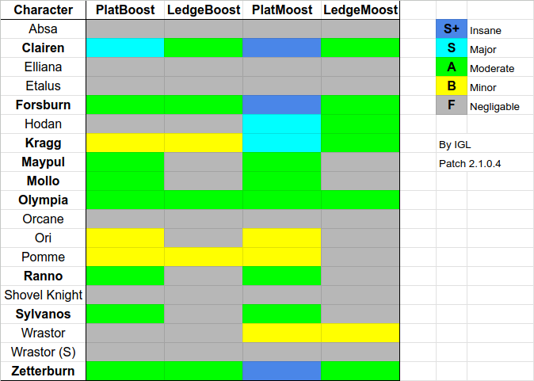

## ¿Cómo impulsarse?

Cuando los personajes corren desde una plataforma, estos van a mantener algo de velocidad que tenían corriendo cuando estén en el aire dependiendo de su estado y propiedades. Los personajes que son más rápidos en el suelo que en aire tienen una "Velocidad horizontal máxima" cuando saltan.

Aquí es donde el **"impulso"** sucede, es un término usado para cualquier técnica que involucra salir de una plataforma durante el Dash inicial que ocurre al correr, lo que le permite a algunos personajes evitar esos límites de velocidad. Esto puede usarse para desbloquear opciones de movilidad muy efectivas alrededor de las plataformas, veamos un ejemplo.



### Técnicas

Un *impulso* puede dividirse en cuatro técnicas o situaciones: en la plataforma, en el borde, plataforma lunar y borde lunar. Como pueden ver estas 4 variantes se pueden catalogar en 2 categorías, según la posición y según la técnica. Veamos a que se refieren.

Las primeras dos variantes son "impulso en la plataforma" e "impulso en el borde" según donde está el personaje. Impulsarse en una plataforma se hace al correr a lo largo de esta, caer a través de ella e inmediatamente saltar, para impulsarse en el borde se debe comenzar a correr, pues en el borde (ya sea de una plataforma o del escenario), y así aprovechar esa velocidad inicial extra. Se debe tomar en cuenta que la velocidad del Dash inicial depende según el personaje, y varia entre 8 y 16 frames, con los Dash más largos se tiene una ventana mayor para hacer la técnica. Esta técnica **NO** funcionará si comienza la animación de correr.

La otra distinción viene en la parte "lunar" o no "lunar". Si un impulso *NO* es lunar, es regular, significa que inicia con un Dash normal, corriendo. Si un impulso es lunar significa que se inicia a partir de una técnica llamada "Moonwalk", tiene propiedades similares a solo correr, pero es 20% más rápido que el Dash inicial para todos los personajes (y vas a ir hacia atrás).

## ¿Qué tan viable es?

Ya habiendo explicado las bases, aquí hay una imagen que explica resumidamente que tan efectivas son las técnicas para cada personaje. Los que están en negrita son los que más se benefician de aprender las técnicas.

Leyenda:
- Platboost => En la plataforma
- Ledgeboost => En el borde
- Platmoost => Plataforma lunar
- Ledgemoost => Borde lunar

Esta técnica puede ser usada para mejorar varias opciones: Ir por Edgeguards profundos, movilidad más rápida para los aéreos y viajar por el stage, incluso más. ¡Dale un intento!
