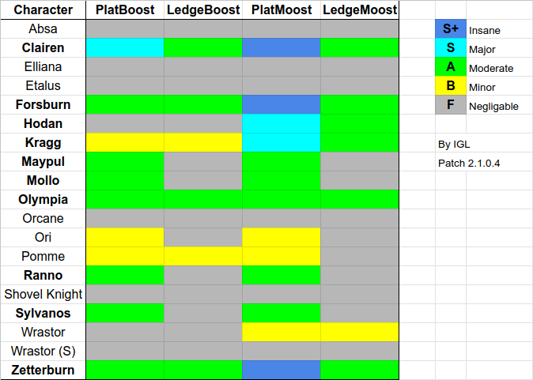

## What is Boosting?

When characters leave a platform, they will carry some amount of speed with them into the air depending on their status and properties. Characters who are faster on the ground than in the air have their speed capped upon leaving mostly due to their "Max Horizontal Jump Speed" stat.

This is where **boosting** comes in, a catch-all term for techniques involving leaving a platform during initial dash that enables certain characters to bypass those speed caps. This can be used to enable highly effective burst movement around platforms, shown below.



### Techniques

Boosting is split up into four techniques: platboost, ledgeboost, platmoost, and ledgemoost.

The first two subcategories of these techniques are **platboosting** vs. **ledgeboosting**. These refer to whether you leave the platform by dropping through with a platform drop (**platboost**) or by dashing off the edge (**ledgeboost**) during your initial dash. Note that the duration of initial dashes varies across the cast from 8 to 16 frames, with the longer dashes giving you a larger window for performing the tech. These techniques will *not* work if you enter the run animation.

The second distinction is **boosting** vs. **moosting**. **Boost** refers to performing the tech via an initial dash. **Moost** refers to performing the tech via a moonwalk, which has similar behavior to initial dash, but at max speed is 20% faster than initial dash for all characters (and you’ll be traveling backwards).

## Cast Viability

With that explanation out of the way, here is my qualitative summary of the effectiveness of these techniques across the cast. Characters that stand to benefit from learning this tech (in my opinion) are bolded.

This tech can be used to enhance a variety of options: going deep for edgeguards, faster movement for platdrop aerials, traveling across platforms, and more. Go try it out!
