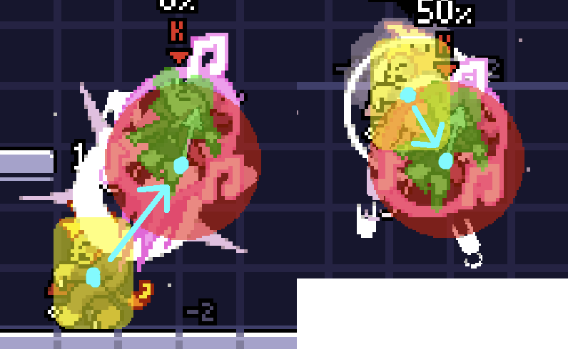

## Flotar

Ser capaz de flotar es la mecánica característica de movilidad de ~~Peach~~Pomme en todos los aspectos de su juego. Pomme puede comenzar a flotar hasta despues de llegar al punto más alto de su salto si mantienes el botón de salto presionado, o antes de llegar al punto más alto de su salto si sostienes hacia abajo mientras sostienes el botón de salto. Una vez iniciado, el flote puede sostenerse hasta un máximo de 2 segundos.



### Flotar en el suelo

Si sostienes hacia abajo antes de tocar el botón de salto es posible hacer que Pomme flote justo sobre el suelo; si sueltas el botón de salto durante este flote Pomme aterrizará justo en el siguiente frame, lo que se puede aprovechar para cancelar aéreos instantáneamente. Los ataques aéreos en el suelo son grandes herramientas para iniciar combos y aplicar presión relativamente segura.



Nota: Si juegas en control, es recomendable configurar uno de los gatillos para el salto. Esto te permite usar el c-stick (palanca derecha) para hacer los aéreos durante el flote sin tener que cambiar la forma en la que sostienes el control.

### Fastfall

La habilidad de flote se puede combinar de forma interesante con las mecánicas propias del juego, por ejemplo se le puede hacer buffer al fastfall antes de comenzar a flotar o durante el flote si se sostiene hacia abajo poco antes de soltar el botón de salto. También es posible hacer un aéreo durante el flote y hacer fastfall después.



### Protección del salto doble

Rivals tiene una mecánica llamada protección del salto doble que restaura el segundo salto si haces un USpecial o airdodge en los primeros 4 frames después del salto. Pomme es especial, porque puede empezar a flotar durante esa misma ventana y obtener el mismo efecto, restaurando su salto doble. Esto puede ser usado para ganar un poco de distancia vertical extra gratis, o para reiniciar la inercia horizontal si se hace un salto en la dirección contraria a la que vas.



### Flote restante

Pomme puede comenzar a flotar en cualquier momento mientras tu "tiempo restante de flote" sea mayor a 0 frames. Esto es importante debido a que las condiciones a las que este tiempo está sujeto no son las más intuitivas:

* Iniciar o continuar un flote: el tiempo restante se reduce en 1 por cada frame que estés flotando.
* Dejar de sostener el botón de salto para dejar de flotar: elimina todo el tiempo restante.
* Ser golpeado mientras estás flotando: elimina todo el tiempo restante.
* Hacer airdodge mientras estás flotando: elimina todo el tiempo restante.
* Hacer un USpecial hacia un Campo musical (DSpecial): el tiempo restante se vuelve 45 frames si te quedan más de 45 frames o se queda igual si te quedan menos de 45 frames. el tiempo de campo musical se vuelve 1 segundo, y el cooldown se reduce al màximo de 5 segundos.
* Aterrizar: reinicia el tiempo restante al máximo de 120 frames (2 segundos).

#### Flote almacenado

Es importante notar que el tiempo restante de flote no va a cambiar en las siguientes situaciones:

* Usar NSpecial para cargar notas.
* Usar USpecial.
* Usar DSpecial.

Estas tres situaciones efectivamente pausan el tiempo de flote sin eliminar el tiempo restante como soltar el botón de salto lo haría. Podemos aprovechar estas situaciones para almacenar el tiempo restante de flote si sueltas el botón de salto durante la animación de alguno de los movimientos que pausan el tiempo restante, permitiéndote usarlo más tarde cuando más te convenga.



## Campo musical

El Campo musical (DSpecial) de Pomme es su mejor herramienta para regresar al escenario ya que aumenta la movilidad aérea de Pomme,  mejorando su flote y su USpecial; y además es por mucho, su movimiento más incomprendido.

### Omniflote

El campo musical mejora la habilidad de flote de Pomme, incrementando su aceleración aérea significativamente y permitiéndole flotar en cualquier dirección en lugar de solo horizontalmente, a este flote mejorado se le llama "omniflote". Esto te permite extender tus combos aéreos o hacer baits en neutral muy efectivos.



Además de los métodos comunes para comenzar a flotar, también puedes empezar un omniflote sosteniendo el botón de salto + arriba. Si combinamos esto con [la protección del salto doble](#protección-del-salto-doble), puedes usar el pequeño impulso de vertical del salto para luego empezar a flotar hacia arriba y así moverte más rápido en el campo musical, y lo mejor de todo es que aún conservas tu salto doble. Aquí una comparación:



### USpecial musical

Si Pomme hace un USpecial dentro del campo musical este será un USpecial mejorado que le devuelve su flote (ver [flote restante](#flote-restante)) y no termina caída libre. El USpecial será mejorado siempre y cuando la hitbox del movimiento entre en contacto con el área del campo musical. Cabe destacar que Pomme solo puede restaurar su flote 1 vez hasta volver a tocar el suelo (o hasta saltar en la pared o recibir un golpe). Si Pomme intenta hacer un segundo USpecial solo hará un pequeño impulso vertical sin hitbox que inmediatamente la pone el caída libre.



Este ejemplo muestra el potencial y la posible creatividad que permiten estas herramientas, permitiendo regresar al escenario por abajo o tomar acción cerca del borde. 

### Curiosidades del campo musical

Si el campo musical se encuentra muy lejos del escenario, este se acercará al mismo por si solo. Horizontalmente, intentará acercarse al escenario hasta que una de sus esquinas toque o esté contenida en los bordes del escenario (ignorando las plataformas que sobresalgan). Verticalmente es más un misterio, pero en general tratará de alejarse de los bordes de la pantalla.

El DSpecial tiene unos bugs tremendos que no voy a explicar, pero aquí hay un clip abusando de la manera en la que el cooldown se supone debería activarse.



## Impulsandose con FAir

El FAir de Pomme la empuja hacia atrás, de manera similar al FAir de Orcane, dándole una opción de movimiento única que puede usar al saltar o flotar. Este impulso añadirá velocidad adicional a tu velocidad horizontal actual, por lo que el efecto puede variar. Usar el FAir mientras te mueves hacia adelante te empujará muy poco hacia atrás, y usarlo mientras te mueves hacia atrás te empujará mucho más.



### Deslizandose con FAir

El FAir alcanza su velocidad máxima mientras el ataque inicia (1 frame antes de que la hitbox salga), y la velocidad disminuye rápidamente después de eso. Si combinamos esto con la poca fricción que tiene Pomme en el suelo, significa que aterrizar en los primeros frames del FAir hace que Pomme se deslice sobre el suelo mucho más rápido que corriendo o con wavedashes.



Esta técnica también permite cancelar ataques en el borde muy fácilmente, una gran opción de movimiento y presión.



## Cancelar la carga de Notas

Pomme puede cancelar la carga de notas (NSpecial) en cualquier momento presionando el botón de parry. Cancelar la carga siempre es más rápido que simplemente soltar el NSpecial para dejar de cargar las notas, haciendo que esta técnica sea estrictamente mejor en todas las situaciones y una herramienta invaluable para Pomme.

Cargar notas mientras Pomme flota causará que deje de flotar, haciendo que Pomme caiga durante la carga de las notas. Una vez que termine la carga, el flote se reanuda con el mismo tiempo restante que tenía antes de empezar a cargar notas (asumiendo no se suelta el botón de salto). Esto hace todavía más importante cancelar las cargas de notas para conservar la altura. Esto usa el mismo principio visto en [flote almacenado](#flote-almacenado), pero continuandolo de inmediato en lugar de guardarlo para más adelante.



También, por alguna razón, es posible mantener presionado el botón de parry para cancelar varias cargas de notas.



### Voltearse con las notas

Es posible usar el NSpecial para voltearse de manera rápida en el aire. Esto se puede usar para aprovechar el FAir para impulsarse de regreso al escenario.



Pomme también puede voltearse usando el cooldown de sus 3 atques especiales. Hacer un NSpecial, FSpecial o DSpecial mientras están en cooldown hace que Pomme se voltee sin ninguna animación, startup o lag.



## Vince

El FSpecial de Pomme lanza al poderosisimo maestrazo Vince. Los oponentes comúnmente pueden golpear a Vince para cancelar su agarre. Sin embargo, cargar por completo el FSpecial hace que Vince sea invulnerable a todos los ataques. Esto es muy útil al tratar de evitar que los oponentes regresen al escenario, ya que golpear a Vince hará que el oponente pase por todo reciba hitpause, facilitando castigarlo.



Pomme también puede cargar el FSpecial mientras flota, incluso en un omniflote. Esta mecánica es muy útil en recuperaciones.



Vince también está lleno de bugs así que hacer una lista de todas las interacciones rotas aquí sería un esfuerzo monumental. Les recomiendo hacer pruebas en sus juegos y tomar notas :)

## Bonus

### Cancelar el DTilt con un salto
Por alguna razón, Pomme puede cancelar su DTilt saltando lol



### DACUS

Todos los personajes de Rivals excepto Wrastor pueden hacer un DACUS. La alta velocidad del Dash Attack de Pomme combinado con su baja fricción en el suelo hace que su DACUS sea bastante impresionante. 



### Ángulo del USpecial

Todos los golpes del UpSpecial de Pomme tienen un angle flipper 2, excepto el último que es el que lanza al oponente, esto hace que su ángulo de knockback sea una línea que empieza del centro de la hurtbox del oponente apuntando hacia el centro de la hitbox de USpecial. Esto puede causar edgeguards muy graciosos, en los que al golpear a un oponente por debajo con USpecial lo lanzará hacia abajo si se cancela el último golpe con un salto en la pared.

"¿Sabias que Pomme en realidad es diminutivo de Pomelo? Esta es una referencia a otro personaje de Melee que también flota cuyo nombre es también una fruta que empieza con P."
