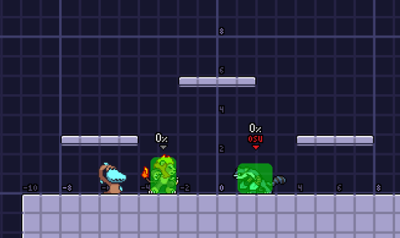

## Como hacerlo

Los jugadores de Maypul más experimentados (o los que terminaron su tutorial) saben que su FSpecial tiene una variante hacia atrás.



Esta variante se logra si se sostiene la dirección opuesta a la original del FSpecial en los primeros 4 frames después de hacer el input original.



Cuatro frames puede parecer una ventana muy pequeña, pero si practicas lo suficiente lo dominarás en poco tiempo. Ahora veamos algunas aplicaciones que tiene esta técnica y por qué es una herramienta invaluable en el kit de Maypul.

## Posibles combos

Antes de seguir se debe mencionar un pequeño detalle del FSpecial: no es muy fácil hacer combos a partir del movimiento. Por ejemplo:



Debido a la distancia entre Zetterburn y Maypul los posibles combos se transforman en un Tech-chase. Incluso, el whifflag es 9 frames mayor que si se hiciera la variante en reversa.



Así que, ¿cómo es que usar la Hitbox en reversa nos ayuda a combear? Veamos el ejemplo de la variante en reversa del FSpecial de nuevo. ¿Notas como el ángulo de la Hitbox regresa con nosotros? Aquí es donde las cosas se ponen interesantes. Como el oponente sale volando hacia donde Maypul se dirige el FSpecial en reversa -> DTilt es un combo bastante común.



Esto funciona consistentemente con DI hacia dentro o si el oponente no hace DI, pero si el oponente hace DI hacia fuera comenzará a conectar alrededor de 40%

¿Qué tal envolver al oponente con Lily?



El FSpecial en reversa puede usarse para lanzar el oponente hacia Lily en una plataforma, el mejor lugar para colocarla por supuesto.



## FSpecial volteado en reversa

Discutamos una situación hipotética:

Maypul está frente a Zetterburn, y necesitamos envolverlo, podríamos lanzarle una semilla y lanzarlo hacia Lily con un FTilt, pero intentemos algo diferente, no se puede hacer simplemente FSpecial, por que alejaría a Zetterburn de Lily, lo mismo que un FSpecial en reversa.

Introduciendo el **"FSpecial en reversa volteado"**. Si haces un FSpecial en la dirección *opuesta* a la que estás viendo, vas a "voltearte" e iniciar el FSpecial y su animacion en esa dirección.



De repente, la situación es muy simple. Simplemente combina la técnica del FSpecial en reversa con el FSpecial volteado para enviar a Zetterburn hacia Lily.



Observa como nos podemos acercar con el FSpecial en reversa volteado y conseguir una apertura con todos los beneficios del FSpecial en reversa sin el riesgo de estar demasiado cerca al oponente. Adicionalmente, observa como la variante en reversa y la variante volteada envían al oponente en direcciones diferentes. La variante en reversa es hacia el origen del golpe, y la variante volteada es opuesto al origen del golpe. Esto puede aprovecharse para castigar DI predecible y colocarte en una buena posición para extender los combos.

Como en cualquier caso, usar demasiado esta técnica facilitará que el oponente te castigue, así que ten cuidado y varía tus opciones durante la partida. Con el uso adecuado puedes aprovechar muchas más oportunidades y castigar mas fuerte al oponente de maneras que no serían posibles de otra forma.
