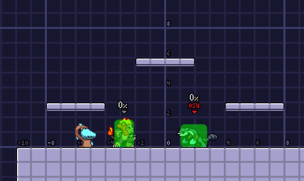

## How To

For the more experienced Maypul players (or just the ones who have finished Maypul’s tutorial), you’re likely aware that her Side Special can be reversed.



Reverse Side Special is performed by inputting the opposite direction of your initial Side Special within four frames of inputting it.



Now, four frames seems like a very short amount of time, but practice this enough and you’ll get the hang of it in no time. However, this post isn’t just about the existence of Reverse Side Special. Instead, I’ll be going through some practical applications of Reverse Side Special and why it’s yet another invaluable tool in Maypul’s arsenal.

## Followups

Before continuing, I’d like to discuss the main problem with Side Special as a combo tool: the fact that it doesn’t easily lead into followups. As an example:



Because of how separated Maypul and Zetterburn are, it turns any potential followups into a tech chase. Indeed, Side Special is even laggier of whiff than if reversed by 9 frames.



So, how does reversing this hitbox help us follow up? Take a look at the Reverse Side Special demonstration again. Notice how the hitbox angle comes back with us? This is where things get spicy. Because the opponent is sent towards where Maypul ends up, Reverse Side Special into Dtilt is a very common combo.



This works on no DI and DI in consistently, however if the opponent chooses to DI out, it will connect at around 40%.

How about wrapping with Lily?



Reverse Side Special can be used to knock the opponent into Lily on a platform, where we all love to place her so much, as well.



## Turnaround Reverse

Let’s discuss a hypothetical situation:

I’m in front of this Zetterburn, and I’d like him to get wrapped. Sure, I could throw seed and Ftilt him into Lily, but I’d like something I can do now. I can’t just Side Special, as that will send him opposite of Lily, and the same case with Reverse Side Special.

Introducing **Turnaround Reverse Side Special**. If you input a Side Special *opposite* to the direction you’re facing (even when running), you’ll immediately turn around and begin the Side Special animation.



Suddenly, this situation is simple! Simply Turnaround Reverse Side Special into Lily.



Notice how we can approach using Turnaround Side Special and get an opening with all the benefits of Reverse Side Special without needing to be in close quarters with the opponent. In addition, notice how Reverse and Turnaround Reverse Side Special send in different directions. Reverse Side Special sends towards the initial hit, while Turnaround Reverse Side Special sends away from the initial hit. This can be used to punish predictable DI and get yourself into a position to extend combos even further.

As always, using this tech too much will get you punished (parries or otherwise), so be careful and don’t spam these in the midst of battle. However, with an appropriate use during a match, Reverse Side Special can lead to bonus opportunities and punishes that wouldn’t have been available otherwise.
