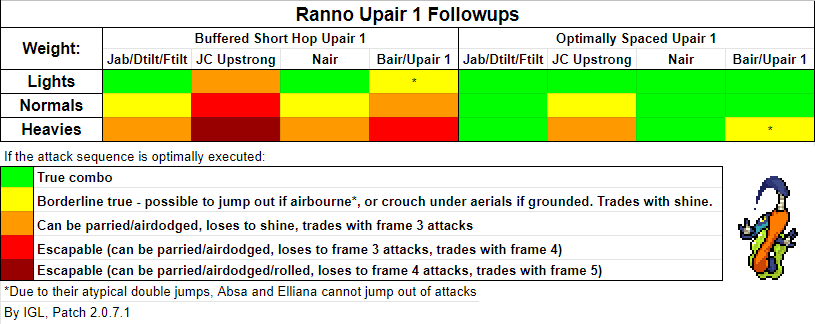

There are a lot of misconceptions about whether this move is true in certain combos or not, and I'm here to clear them all up right here in this post! Ranno's Up Air 1 is a unique move in that it applies a set amount of knockback and hitstun. This allows the move to function the same whether the enemy is at 0% or 200%. Knowing this, let's look at what scenarios will allow us to reliably combo this hitbox into other moves. The factors this will depend on include:
- The opponent's weight
- What move we choose to follow up with
- How close to the ground we land Up Air 1

## Weight

The more weight a character has, the less hitstun they take, which means the heavier character will be able to act out quicker. This is very apparent when going for Jab, Down Tilt, and Forward Tilt followups.

Against a lighter character like Maypul, all 3 of these followups are true combos.



Against a heavier character like Kragg, however, all 3 of these followups are able to be parried.



## Followup

Our move selection is affected by the fact that upon landing after connecting Up Air 1, we'll be put into 4 frames of landing lag. We can choose to wait this lag out and use a grounded option like we did above, or we can [cancel that lag into a jump](/lectures/understanding-landing-lag), which lets us either follow up with an aerial or cancel our jump into an Up Strong instead. 
Ranno's fastest grounded followups, shown in the earlier clips, take 9 frames (4f landing lag + 5f attack start up).

Following up with Nair also takes 9 frames (5f jumpsquat + 4f attack startup), making it a viable combo option as well.



But even with an immediate jump cancel, Up Strong will take 11 frames to come out (11f attack startup), slow enough to be parryable. 



We can still get this move to combo however if we make use of the final factor:

## Spacing

The closer we are to the ground when we connect with the Up Air, the less time it takes to fall to the ground and become actionable, giving us better ability to follow up. So far, all of our examples have used a buffered shorthop Up Air, but if we space the Up Air so we're right next to the ground when it hits, we'll be actionable up to 2 frames sooner.

With those extra frames, we can now combo into Up Strong!



## All Together

Now that we're armed with an understanding of all the factors, we can reference this table that summarizes the viability of Ranno's Up Air 1 combos based on them:

Note: Even though some of these combos are labeled "true", they can be really hard to pull off, as you have to be frame perfect in your jumps and attacks. However, this doesn't take away from the effectiveness of Up Air 1. The move comes out so fast (especially combined with hitfalls) it barely gives your opponent anytime to react and put out a defensive option.

Note: None of these combos will true followup regardless of character weight, the followup move, or Up Air spacing if Up Air 1 is crouch cancelled. If you see an opponent crouch cancel your Up Air 1, I suggest you wait out their parry and punish accordingly.

Here's an example of Up Air 1's utility outside of being a move used to true combo into other moves:


