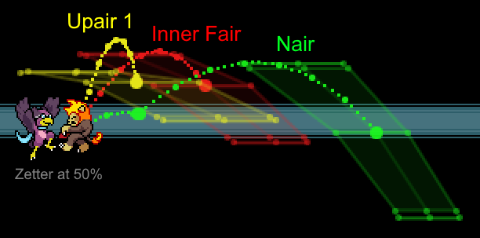
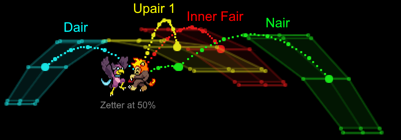
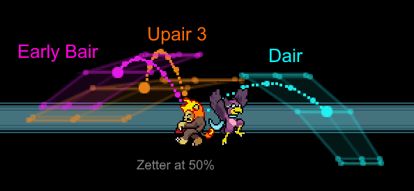

Saludos main pájaro, esta guía contiene una explicación de como tratar las estategias ofensivas y el neutral de Wrastor, sus combos, Mixups y confirms. Wrastor es un personaje muy flexible a la hora de jugar, así que esta guía se enfoca más en explicar conceptos generales, no tanto de definir "la forma correcta" de jugarlo ya que cada jugador tiene su estilo único. Esta guía no busca ser la guía definitiva de Wrastor, todavía hay muchos aspectos de Wrastor que pueden explorarse más allá de lo que hay aquí.

## Juego neutral

La estrategia más común en neutral se conoce como "provocar y castigar" que consiste en castigar el Lag de fallo. Suele funcionar mejor que tratar de abrumar al rival con golpes, intentar controlar el escenario o depender de ir haciendo daño poco a poco debido a lo ligero que es Wrastor. Con esta estrategia Wrastor aprovecha su alto potencial para combos a la hora de castigar y evita recibir daño innecesario de la forma más efectiva posible. 

La estrategia funciona mejor si tienes en mente lo siguiente:
- Aprovecha la alta velocidad que obtiene Wrastor en el Slipstream (FSpecial) y los múltiples saltos que posee para entrar y salir del rango de ataque del oponente.
- Alejate preventivamente para evitar los ataques.
- Castiga el Lag de fallo del oponente e inicia tu propio combo.

Esta es una estrategia universal en los juegos de pelea, pero Wrastor la utiliza bastante por las características que posee:
- Alta velocidad para moverse por el escenario.
- Ataques cuerpo a cuerpo con buen alcance y rápidos.
- Peso ligero, así que si intercambia un golpe casi nunca es a favor de Wrastor.
- Falta de herramientas para atacar desde lejos o hacer daño constantemente, Wrastor depende de combos extensos para poder eliminar al oponente.

### Juego terrestre

Para poder posicionar correctamente los Tilts en el suelo los personajes usualmente requieren hacer Wavedash, Babydash, caminar, etc. Todas estas opciones tienen sus pros y sus contras. Wavedashing y agacharse requieren comprometer 6 y 16 frames respectivamente, caminar es muy lento y hacer Babydash puede ser difícil e inconsistente. Sin embargo, Wrastor tiene una propiedad bastante interesante, como sus ataques fuertes solo se pueden usar en el aire, esto le da la oportunidad de cancelar las acciónes de movilidad terrestres realizando un Tilt al presionar el botón de ataque fuerte, lo que le permite ser rápido y preciso a la hora de posicionar sus ataques en el suelo.



Una situación común en la que se trata de castigar el Lag de fallo es al provocar ataques aéreos desde abajo. Como Wrastor no tiene una buena herramienta antiaérea, puedes tratar de anticipar un movimiento que venga hacia ti, quitarte del camino y castigar el Lag de aterrizaje en lugar de hacer Parry o roll, ya que estas 2 opciones requieren más compromiso y pueden ser una trampa del oponente al provocarte a reaccionar de esa forma. Cabe destacar que el Lag de aterrizaje va a variar según el personaje o movimiento.

Dentro del Slipstream Wrastor obtiene una de las mejores opciones de movilidad terrestre en todo el juego. Puede aprovechar el incremento de velocidad de diversas formas para confundir al oponente y capitalizar en el momento en el que se equivoque.



### Juego aéreo

La alta movilidad horizontal que tiene Wrastor dentro del Slipstream, combinado con tener 3 saltos dobles, le permite fingir atacar desde arriba y provocar al oponente a hacer alguna opción que lo deja vulneravle para así castigarlo. Hacer Drift para entrar y salir del rango del oponente es bastante efectivo, especialmente en el Slipstream.



Combina esto con el uso de Wavelands para moverte a lo largo de las plataformas y así recuperar tus saltos dobles, hacer un Dash Attack desde la plataforma, o aéreos normales a través de la plataforma para mantenerte impredecible y explosivo.

### Elección de movimiento

Otra cosa a considerar es la elección de movimiento. Generalmente Wrastor trata de castigar al oponente con algún movimiento que tenga la siguiente combinación de características:
- Disjointed (la Hitbox tiene más alcance que la Hurtbox), implica que tiene buen alcance.
- Startup rápido y/o poco Endlag.
- Hitbox con muchos frames activos, por lo menos relativo a la duración del movimiento.

Si se tuvieran que ordenar los movimientos según utilidad en neutral:
- **S**: BAir, DTilt.
- **A**: Dash Attack, Jab, NAir, Slipstream (proyectil), FAir.
- **B**: UAir, DAir, FTilt, DSpecial.
- **F**: Todo lo demás.
 
Todo esto no significa que esta es la única forma efectiva de jugar ni la única estrategia para el neutral. Acercarse al oponente directamente de vez en cuando es un buen Mixup, especialmente si eres lo suficientemente bueno provocando y castigando para hacer que el oponente se vuelva timido a la hora de atacar, facilitandote ir a atacarlo. Asegurate de experimentar y de combinar esta estrategia para neutral con la siguiente estrategia para castigar para aumentar tu posibilidad de victoria con el ave.

## Castigar

Considera la siguiente frase *"Con Wrastor, todo es posible, pero nada está asegurado"*. 

En lugar de depender de unos cuantos confirms, Wrastor tiene acceso a cerca de 200 posibles formas de eliminar una stock. Cada uno de sus ataques normales puede iniciar un combo hacia cualquiera de sus movimientos capaces de eliminar al oponente, siempre que se cumplan las condiciones necesarias.

<!-- ### Añadir daño

Para subirle el daño al oponente puedes usar Tilts y cancelarlos con un salto o aéreos y hacerles Hitfall. El combo más común es DTilt -> UAir/FAir -> etc. pero cualquier ataque normal puede iniciar el combo. Wrastor puede cambiar de ataques terrestres a aéreos en porcentajes bajos-medios, lo que le da mucha flexibilidad.

 -->

### Hasta la Blastzone

#### Combos horizontales
Usa el NAir, FAir y UAir para combear al oponente hacia fuera, trata de mantenerte en el Slipstream para mantener la velocidad. Utiliza el DAir como Mixup contra el DI del oponente y ajusta tu posicionamiento (volveremos a esto más tarde).



Si estás dentro del escenario, el Sweetspot del UTilt lanzará al oponente lateralmente, mientras que el FTilt puede conectar consigo mismo o sacar al oponente del escenario si se está suficientemente cerca del borde, para así tratar de hacer Spike con el DAir.



#### Combos verticales
Usa el BAir, UAir, FAir y DAir para malabarear al oponente, trata de anticipar su DI y mantenerlos cerca. Recupera tus saltos dobles en las plataformas de ser posible, de lo contrario a veces se puede usar DSpecial si estás sobre el rival para "reiniciar" la situación. Si hacen DI hacia fuera puedes tratar de evitar que regresen al escenario o perseguirlos con el Slipstream.



### Preparate para eliminar

#### Por los lados
Todos los aéreos y los Tilts de Wrastor pueden conectar con el FStrong con el DI adecuado. También pueden conectar con el Sweetspot del USpecial, ya que son parecidos en fuerza, pero hay que posicionarse diferente y es un poco más riesgoso y difícil.

[Un estudio de IGL](https://docs.google.com/spreadsheets/d/18c7od0wON5htoKAXrdSFzmAy3B92KkhRy21s6n-aQeI) revela que ~43% de las stocks que Wrastor elimina son gracias al FStrong, asi que esta debería ser tu opción principal.



Si los oponentes están muy cerca de la Blastzone, un simple NAir, la punta del FAir o el Spike del DAir suelen ser suficiente para eliminarlo.



#### Por arriba
Busca usar el UStrong, un NSpecial ascendente o el USpecial. Si crees que el oponente va a hacer DI hacia fuera, puedes usar DAir como Mixup o dejar que el FStrong o el NAir lo lance fuera del escenario (o que directamente lo elimine por la Blastzone lateral). Es muy importante aprender a reconocer qué Blastzone debe enfocarse durante el combo o cuando cambiar ese enfoque.



#### En porcentajes altos
Wrastor tiene una infinidad de rutas diferentes en sus combos, puede jugarse con mucha libertad. Cada Main Wrastor va a desarrollar su propio estilo, pero a pesar de tener las mejores intenciones van a ocurrir errores y vamos a quedar con el oponente en porcentajes medios-altos en neutral. **Una vez que la mayoría de personajes superan el 80-100% muchos de los Confirms aéreos de Wrastor dejan de funcionar** por lo que se debe buscar las condiciones y el DI correcto. En esta situación, lanzar ataques fuertes a lo loco es una manera fácil para que te castiguen; en lugar de eso lo que quieres es usar movimientos que son más seguros y ayudan a iniciar un combo, buscando reaccionar al DI del rival.

Los mejores Confirms para porcentajes medios-altos incluyen:
- **DTilt -> Atq Fuerte.** UStrong suele eliminar al oponente más temprano, pero FStrong es mejor atrapando el DI hacia fuera, lo que más fácil con la ayuda del Slipstream.
- **Dash Attack (desde una plataforma) -> Atq Fuerte.** Este combo funciona en casi cualquier % y es bastante seguro debido al poco Endlag y la alta movilidad del Dash Attack. Un Dash Attack en el suelo también funciona pero tiene más Endlag.
- **DSpecial -> Atq Fuerte.** Este combo funciona mejor si el Slipstream ya está en el escenario. Si no puedes alcanzar al oponente el DSpecial va a forzar al oponente a hacer Tech en casi cualquier situación, por lo que solo te quedaría reaccionar para castigar.


En este video el bot tiene 130% y DI aleatorio, aún así es posible reaccionar para conectar el Atq Fuerte. Aquí también se puede reemplazar el Atq Fuerte con el Sweetspot del USpecial, pero es más difícil de conectar. 

Existen muchos factores y opciones a considerar aquí, pero no son tan universales o sencillas como el ejemplo anterior, usualmente requieren un Parry o un DI específico para funcionar. Entre los cuales está el UTilt -> Atq Fuerte y el Jab 3 -> Atq Fuerte. 

Hablando de castigar después de un Parry, la mayoría de los Main Wrastor suele usar únicamente el Sweetspot del USpecial, esta opción puede ser contrarrestada haciendo DI hacia arriba. Pero si se usa alguna de las opciones ya mencionadas, puedes atrapar ese DI con otro movimiento para continuar con un combo, lo que te va a ayudar a eliminar al oponente más temprano que simplemente castigando el Parry con el USpecial.

Si el oponente llega a porcentajes muy altos (más de 130%) puedes intentar conectar uno que otro golpe aislado, es decir, no necesariamente buscando iniciar un combo para asegurar la stock. Los primeros frames del BAir puede eliminar al oponente desde una plataforma si hace DI hacia dentro, o lo deja posicionado para usar el Sourspot del USpecial cerca de la Blastzone superior.



De manera similar, los primeros frames del NAir 2 puede lanzarlos bastante fuerte con la ventaja de no tener tanto Endlag como el FStrong o lag de fallo si no aciertas el golpe. El Spike del DAir también es suficiente para eliminar al oponente en estos porcentajes, solo necesitas que el oponente esté sobre el borde o fuera del escenario (puede ser dentro del escenario si fallan el Tech).

## Mixups a profundidad

Una de las primeras cosas que aprenden los jugadores es que necesitan "hacer DI para escapar combos" y "hacer DI para sobrevivir a los ataques". Así que veamos que puede hacer Wrastor para contrarrestar esa estrategía y mantener las ventajas que hemos discutido anteriormente.

Lo primero que debes saber es que dentro del Slipstream Wrastor obtiene la habilidad de cubrir el DI hacia fuera si mantienes tu velocidad. Veamos un escenario básico en donde el oponente esta frente a Wrastor con un porcentaje bajo-medio. Aquí tus 3 herramientas principales para iniciar un combo son UAir, FAir y NAir, los cuales cubren un buen rango de ángulos. El objetivo es mantener al rival dentro del rango que conectan tus ataques, y al mismo tiempo empujarlos para sacarlos del escenario, por lo que necesitas mantener tu velocidad/inercia.

Si crees que van a hacer DI hacia fuera, utiliza UAir (75°) o la parte interna del FAir (60°) para mantenerlos cerca.
Si crees que van a hacer DI hacia dentro, utiliza NAir (30° + 45°) o la punta del FAir (40°) para empujarlos.

Combina estas opciones e intercambialas según sea necesario. Si logras conectar una que otra vez estas opciones y el oponente va a estar fuera del escenario donde tendrás mas oportunidad de eliminarlo. 

La siguiente imagen muestra el área en la que cada movimiento lanza a Zetterburn con 50%, con la línea punteada central siendo la trayectoría sin DI y sin Drift.

Si te encuentras atrapado en un combo de Wrastor mientras está en el Slipstream, considera las siguientes opciones para escapar:
- Hacer DI hacia dentro a los primeros golpes para obligar a Wrastor a frenar, aumentando tus probabilidades de escapar.
- Si te encuentras cerca del suelo, hacer DI hacia abajo para intentar hacer Tech.
- Hacer DI hacia una plataforma para hacer Tech o una opción/ataque rápido.

### DAir

Ahora, discutamos la misma situaición que antes, pero sin acceso al Slipstream. Nuestras 3 herramientas principales no van a ser suficiente si el oponente hace DI hacia fuera, especialmente si no mantienes correctamente tu velocidad. Puedes tratar de utilizar un FStrong o un USpecial más temprano de lo usual para lanzarlo, pero es posible que no sea suficiente para eliminarlo si hacen DI hacia dentro. En este caso podemos considerar una de las mejores herramientas para Mixup en todo el juego: **DAir**. A diferencia de la mayoría de movimientos, en lugar de enviar el oponente hacia fuera o hacia arriba, el DAir lanzará al oponente *a través* de Wrastor, como en la siguiente imagen.

DAir es absurdamente poderoso en los combos. Normalmente un DI hacia fuera/abajo le permite escapar a los oponentes que estan frente a Wrastor, así que las opciones que ya fueron mencionadas son FAir para extender el combo o FStrong/USpecial para tratar de eliminarlos. Pero en este caso tenemos una tercera opción: Lanzarlos hacia atrás con el DAir, de este modo podemos mantenerlos cerca para alargar el combo hacia arriba. Gracias a esto puedes escoger entre sacarlos del escenario o malabarearlos un poco para subir el %. La mejor opción del oponente para escapar el DAir es hacer DI hacia abajo, pero esto es riesgoso ya que el DI hacia abajo es casi completamente inútil contra el UAir y es una mala opción contra el FStrong y el USpecial.

### DAir sobreextendido

El DAir se puede aplicar a otra situación. Digamos que el oponente hace DI hacia dentro y te sobreextendiste hacia adelante, el rival está detrás de ti.

Ahora tenemos una situación similar a la anterior, excepto que es peor ya que la inercia nos va a llevar en la dirección equivocada (vamos hacia adelante, necesitamos perseguir hacia atrás). Aún con el Slipstream y las diferentes Hitbox del UAir, si el oponente mantiene el DI hacia atrás es posible que no podamos frenar a tiempo. Aquí es donde el DAir nos va a salvar de nuevo, la parte trasera del movimiento va a lanzar el oponente de manera en la que va a quedar frente a Wrastor o por encima de Wrastor una vez más, lo que permite ajustar la posición y continuar el combo.



### Lanzar el Slipstream

Finalmente, consideremos una situación en donde simplemente no se pudo reaccionar al DI del oponente: no controlaste tu velocidad correctamente y ahora están fuera del rango de tus ataques. Aquí podemos considerar **lanzar el proyectil del Slipstream para intentar mantener el combo**. El pequeño tornado del Slipstream como tal no tiene mucho Hitstun, pero puede interrumpir la inercia y/o los movimientos del oponente (cuando están iniciando) y darte una pequeña ventana para rescatar el combo, además de poner el Slipstream en el escenario que va a ayudar a reaccionar al DI del oponente al aumentar tu velocidad.



Sin embargo, esta técnica conlleva una gran advertencia: **Slipstream no garantiza que un combo funcione**. Incluso con un posicionamiento óptimo el oponente puede ser capaz de usar un Airdodge o algún ataque rápido antes de que puedas atacarlo. Aunque sea difícil reaccionar al Slipstream, los jugadores experimentados pueden estar preparados a esta situación y listos para escapar. Debes aprender a evaluar el riesgo y la recompensa de intentar extender los combos de Wrastor, así que experimenta y esculpe tu playstyle acorde a eso.

Sin importar que el Slipstream y el DAir son herramientas muy poderosas, recuerda que Wrastor aún puede utlizar Mixups tradicionales. Tal vez en el combo de Dash Attack -> FStrong puedes usar un UAir o un FAir después del Dash Attack para atraparlos haciendo DI hacia dentro y poder terminar con un UStrong. Saber reconocer el patrón de DI del oponente es importante a la hora de tomar estas decisiones como Main Wrastor.

### Más

Este análisis esta basado principalmente en combos mayormente aéreos, ¡pero no olvidemos sus opciones terrestres! Aprovechar las plataformas es una excelente forma de combinar ataques aéreos y terrestres , pero añade más factores a considerar. Podemos aplicar la misma teoría: usar movimientos que ayuden con la dirección en la que Wrastor se mueve y según la situación. 

Algunas opciones terrestres disponibles son:
- Dash Attack como Mixup, especialmente porque ayuda la movilidad de Wrastor.
- DTilt es una herramienta estándar para iniciar un combo y mantiene al oponente cerca.
- FTilt y Jab pueden interrumpir el ritmo del rival o reiniciar el propio.
- UTilt puede lanzarlos fuera del escenario.
- DSpecial es algo mañoso, puede ser difícil de usar en medio del combo pero puede reiniciar la situación.

Puedes aplicar todas estas herramientas tras aterrizar en la plataforma con un Waveland para extender los combos de Wrastor en formas diferentes en lugar de solo malabarear al oponente.



Conforme vayas jugando, experimenta con diferentes opciones para combear y eliminar al oponente, necesitarás familiarizarte con el kit de Wrastor para añadir más opciones a tu arsenal y estar preparado ante cualquier situación. Aparte de eso también debes aprender a reaccionar a tu oponente, balancear el riesgo y la recompensa de extender los combos y saber el momento correcto para cambiar la ruta del combo o los Mixups.

Con todo eso dicho, ojalá esta guía te haya ayudado a introducirte a la amenaza aérea que es Wrastor. Tiene mucha libertad para combos en un juego que ya le da bastante libertad a los jugadores en la forma de jugar, ¡que no te de miedo ponerte creativo mientras juegas!