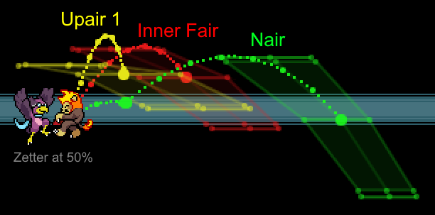
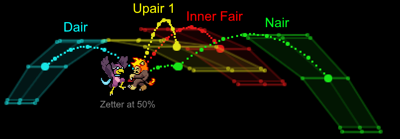
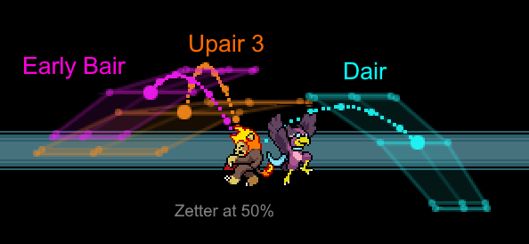

Hello bird mains, this guide contains an explanation of how I approach Wrastor's offense— neutral, combo strategy, combo mixups, and kill confirms. Because of how freeform Wrastor can be played, this guide is more focused on explaining the strategy and concepts. As such, other Wrastor players may have their own approaches to the character but I believe the information here is general enough to be applicable by anyone. This guide is not intended to be all-encompassing; there are many more aspects of Wrastor's game to explore beyond what I write about here.

## Neutral Game

The most common strategy employed in neutral by Wrastor players is known as "bait and punish" or "whiff punish." Rather than rushdown, chip away at opponents, or dominate stage control, Wrastor instead seeks to access his explosive punish game while avoiding any unnecessary damage in the most effective way possible. The strategy works as follows:
- Use Wrastor's high horizontal speed in Slipstream and/or multiple jumps to enter your opponent's attack range, baiting them into attacking you
- Preemptively move away to avoid the attack
- Punish the endlag of their whiffed attack and begin your combo

This strategy is universal to fighting games, but Wrastors utilize it heavily for a few main reasons:
- Wrastor has fast movement and quick high ranged melee attacks, both making the technique easier
- Wrastor is so light that trading is almost never in his favor— he wants clean openings
- Wrastor relies on extended combos to kill— he does not have effective tools to apply stage control or chip damage from afar

### Grounded Play

In Slipstream, Wrastor gains access to some of the fastest and most versatile grounded movement in the game. Utilize your increased speed with dash dancing, wavedashing, and even moonwalking to maintain tricky movement and capitalize when your opponent slips up.

In order to space tilts on the ground, characters must normally either wavedash, babydash, walk, or run-cancel (crouch), all of which have their benefits and drawbacks. Wavedashing and run-cancelling require commitments of 6 and 16 frames respectively, while walking is very slow, and babydashing is challenging to be consistent with. However, due to an interesting quirk regarding his strongs only being usable in the air, Wrastor has the powerful ability to cancel his initial dash with a tilt at any time simply by inputting the tilt with strong rather than attack, allowing for quick, precise, and easy to execute adjustments to your grounded spacing.



A common whiff punish situation is baiting aerials from below. Since Wrastor lacks a good anti-air, if you anticipate one coming you can move out of the way and punish the landing lag instead of parrying/rolling, which are more committal and can be intentionally baited. Note that different characters will have different landing lag values.



### Aerial Play

Wrastor's very high horizontal aerial mobility in Slipstream, combined with having access to 3 midair jumps, grants him unparallelled ability to feign attacks from above and bait his opponent into committing to a punishable anti-air or defensive option. Drifting in and back out of their range is very effective, especially in Slipstream.



Combine with using waveland platform movement to reset your jumps, Dash Attack off platforms, and platdrop aerials to really make your movement unpredictable and explosive.

### Move Choice

Another consideration is move choice. Generally you're looking to get in with moves that are a good combination of:
- Disjointed (hitbox extends past hurtbox), typically also implies high range
- Fast startup and/or low endlag/FAF
- Long hitbox duration relative to the total move

If I had to rank Wrastor's moves in terms of their utility in neutral:
- **S**: Bair, Dtilt  
- **A**: Dash Attack, Jab, Nair, Slipstream (projectile), Fair  
- **B**: Up Air, Dair, Ftilt, Down Special  
- **F**: Everything else  
 
Now all this isn't to say this is the only effective neutral strategy. Mixing in raw approaches or some occasional chip-damage play keeps the opponent on their toes, especially if you've proven to them you can bait and punish so effectively that it makes them attack shy, giving you easy openings. Make sure to experiment and look to combine this neutral strategy with the upcoming punish game strategies and you'll be well on your way to winning more games with the bird.

## Punish Game

Consider the phrase “**With Wrastor, everything is possible, but nothing is guaranteed.**” Rather than rely on a few consistent kill confirms, Wrastor instead has access to over 200 potential ways to set up for a kill, as every single one of his normals can combo into any of his kill moves given the right conditions. As such, a common strategy birds employ is one of positional advantage. After tacking on some damage, look to combo your opponent towards a blastzone where you can either bait or outright force certain DI that you're ready for, enabling you to land the killing blow.

<!-- ### Add Damage

Use jump canceled tilts and shorthop hitfall aerials to quickly build damage to mid%. The most common set up is Dtilt > Up Air/Fair > etc. but any normal can start your combo. Wrastor can easily switch from grounded to aerial attacks at low-mid%s, giving him lots of flexibility here.

 -->

### Push to a Blastzone

#### Combo Horizontally (Stage Carry + Edgeguard)
Use Nair, Fair, and Up Air to combo them outwards, aiming to stay in Slipstream to maintain momentum. Use Dair to mix up their DI and adjust for overshoots in positioning (more on all this later).



If you're onstage, sweetspot Up Tilt will throw them sideways, while Ftilt can link into itself or near ledge either force them offstage or set up for a Dair spike.



#### Combo Vertically (Towards the Top)
Use Bair, Up Air, Fair, and Dair to juggle them, doing your best to anticipate their DI and keep them close. Reset your jumps on plats if possible, otherwise aerial Down Special can sometimes be used as a reset tool here if you find yourself above them. If they DI out, you can switch to an edgeguard or chase with Slipstream.



### Set Up the Kill

#### Off the Side
All of your aerials and tilts can link into Forward Strong on the right DI. Sweetspot Up Special can replace it as it has similar strength (but different spacing), but it carries more risk and can be finicky to connect if the setup isn't quite right. ~43% of Wrastor kills from [my study](https://docs.google.com/spreadsheets/d/18c7od0wON5htoKAXrdSFzmAy3B92KkhRy21s6n-aQeI) were from Fstrong, so it should be your primary kill option.



If they're very close to the blastzone, a simple Nair, Tipper Fair, or Dair spike can often be enough to kill.



#### Off the Top
Look for Up Strong, rising Neutral Special, and Up Special. If you think they'll DI your next hit out, either use Dair to mix up or let Forward Strong/Nair rip to throw them offstage (or outright kill off the side). Being able to recognize when to switch your target blastzone is an important sense to develop.



#### Higher Percent Setups

Wrastor has endless combinations for combos, and can be played extremely freeform. Every Wrastor ends up developing their own combo style. But despite our best intentions, mistakes will happen and we’ll often be left with an opponent at mid-high%s in neutral. **Once most characters get past 80-100% or so, many of Wrastor’s aerial confirms stop working as well** and need the right setup and/or DI. In this situation, throwing out raw Claps is an easy way to get yourself punished; Instead you’ll want to use moves that are safer to throw out and can combo better at a variety of %s, aiming to react to their DI.

The best mid-high% confirms for this include:
- **Dtilt > Clap**. Up Strong will usually kill earlier, but Fstrong works better to catch DI out, which will be easier if Slipstream is already out.
- **Dash Attack (off plat) > Clap**. This combo works at nearly any % and is usually very reactable due to the low endlag and preservation of momentum the move offers. Grounded dash attack can also work, but is laggier.
- **Down Special > Clap**. This works best if you already have Slipstream out. If you can’t reach them, this move will force a techchase in almost any circumstance.


Here I set a bot to 130% with random DI and react to land the Clap. You can also use Sweetspot Up Special in place of Clap, but it can be tougher to land.

There are plenty more options to consider here, but they are not as universal or as easy to set up as the above, often requiring a parry to set up or convenient DI to land. These include Up Tilt Spike > Clap and Jab 3 > Clap. Speaking of parry punishes, most Wrastors will just use raw Up Special (or run through Up Special), which can be countered by DI up. But by using one of the options discussed here instead, you can call out that DI up/in with a combo move, setting up for an easy Clap or Up Special that will kill earlier than the raw Up Special would have.

If they really start getting to high %s (>130%) you can attempt to land **stray hits** such as early bair, which due to its high knockback growth can outright kill with DI in from plats or often set up for a Sour Up Special near the top.



Similarly, an Early Nair 2 can throw them off the side without the endlag of a Clap if you whiff. Dair spike will also start outright killing here, you just need them to be above ledge or offstage (or miss the tech).

As you continue to play, experiment with different combo options and kill setups to find your own way of accomplishing things. As you gain experience with Wrastor and get familiar with his kit you can keep adding options to your arsenal to help answer any defensive strategy the opponent may throw your way.

## Mixups Deep Dive

One of the first major guidelines players often abide by is “DI out to escape combos, DI in to survive kill moves”. So as Wrastor, let's explore ways we can counter that strategy and maintain that positional advantage we discussed above.

The first thing to know is that being in Slipstream generally gives Wrastor the ability to cover DI out if you can maintain your momentum. Let's look at the basic scenario where they're in front of you at low-mid% and you're moving to the right. Here your main three combo tools will be Up Air, Fair, and Nair, which cover a good range of angles. The goal is to keep them within your melee attack range, but continue to push them sideways so you can maintain your momentum.

- If you think they'll hold out (→), use Up Air (75°) or Inner Fair (60°) to keep them close. 
- If you think they'll hold in (←), use Nair (30° + 45°) or Tipper Fair (40°) to push them outwards.

Blend these together and switch between them based on your opponent's actions. Land a few of these, and they'll be offstage where you can set up to finish the stock. Pictured below are the zones where these moves can send vs. Zetter at 50%, with the main dotted path showing no DI or drift.

If you're the one getting comboed by Wrastor in Slipstream, you want to leave that zone. Your options include:
- Holding in the first few hits to shift yourself up and disrupt his momentum, giving you better odds at escape
- If you're near stage, hold hard down/out to get low and try to land a tech
- DI to the nearest platform and look to tech or use a grounded wakeup option

### Dair

Now, what if we're in the same position, but without access to Slipstream? Even an Up Air may not keep them close enough vs. DI out, especially if our rightward momentum has been disrupted. You could try an early Fstrong or Up Special and send them flying sideways, but if they hold in, it probably won't kill. Here we can consider using the greatest mix up tool in the game: **Dair**. Unlike most moves that push up and/or away, Dair will instead throw them *across* Wrastor.

Dair is absurdly powerful for combos. Normally, DI out/down lets people escape once they're in front of you, so the main mix up most characterss have is simply whether they use a combo move (like Fair) or kill move (like Fstrong/Up Special), but Dair gives us a 3rd option: throw them backwards, keeping them close for follow up and allowing you to continue the combo upwards instead. This lets you choose between setting up an edgeguard vs. juggling them for more damage. The best counterplay to avoid this mixup is to DI straight down, but this can be risky as it does almost nothing vs. Up Air and is also very poor DI on Fstrong/Up Special.

### Overshoot Dair

Dair also provides another useful function, arguably more important than the first. Say they unexpectedly held in and you've overshot your position— they're behind you.

Now we have a similar scenario to last time, except it's even worse due to our momentum being in the wrong direction (headed right, but need to chase left). Even with Slipstream speed and a vertical move like Up Air 3, if they hold out (←) we may not be able to shift momentum in time. Dair rescues us again here. The back hit brings them in front of or above us, letting us combo and adjust for overshoot.



### Throwing Slipstream

Finally, let's consider a scenario where their DI got the better of you: they screwed up your momentum and are just outside of melee range. Here, we can consider **throwing the Slipstream projectile itself to attempt to keep the combo going**. It barely has any hitstun, but can interrupt your opponent's momentum and/or attack startup and give you a brief window to combo. Plus, now you have Slipstream active, which lets you follow up on DI out if they try it again.



This technique comes with a huge caveat, however: **followups off of Slipstream are almost never true**. Even with optimal spacing, if Slipstream hits the front of their hurtbox it can always be airdodged out of or often countered by fast attacks. While it is difficult to react to, experienced opponents may be aware of this scenario and be ready to break out. Balancing the risk/reward of combo extensions is an essential Wrastor skill that comes with time, so experiment and model your playstyle accordingly.

### More

While Slipstream and Dair are both incredibly powerful tools, remember that Wrastor can still utilize traditional mixups, namely choosing when to use a strong attack vs. a weak combo tool. Maybe you've been landing Dash Attack -> Fstrong, so they hold in to survive. Instead, you can go for an Up Air/Fair off the Dash Attack, which on DI in should set up nicely for an Up Strong off the top. Getting a feel for making these decisions is another important skill for Wrastor players to develop.

This analysis has dealt mainly with aerial-based combos, but do not neglect his grounded options! Using platform movement to combine aerial + grounded attacks is very powerful, but has more factors going on that are tougher to boil down. The same theory applies however: use moves that compliment your momentum and the situation at hand. Mixing in Dash Attacks is highly effective since it also serves as movement. Dtilt can be used as a standard combo tool that keeps them closer. Ftilt and Jab can serve as good pace-breakers and help to stop their momentum. Up Tilt can be used to push them offstage. DownB is tricky to land during combos but can be a useful reset tool. In short, don't forget to use Wrastor's wavelanding ability and grounded options to extend his combos in more unique ways instead of relying solely on aerial juggles.



With all that said, I hope this guide served as a healthy introduction to Wrastor's gameplan. He packs the most freeform combos in an already freeform game, so be sure to practice and experiment. Now go land some combos.
